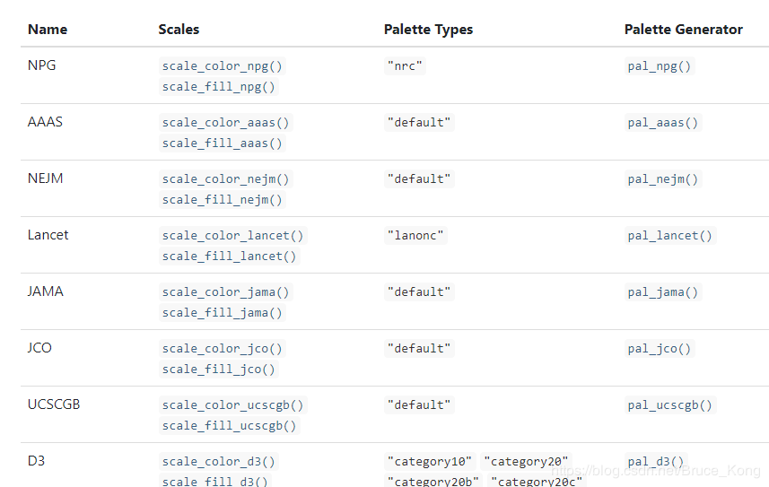

```R
library("ggsci")
```



```R
pal_lancet("lanonc")(9)
```


**lancet配色**

`"#00468BFF" "#ED0000FF" "#42B540FF" "#0099B4FF" "#925E9FFF" "#FDAF91FF" "#AD002AFF" "#ADB6B6FF"`

**d3配色**

`[1] "#1F77B4FF" "#FF7F0EFF" "#2CA02CFF" "#D62728FF" "#9467BDFF" "#8C564BFF" "#E377C2FF" "#7F7F7FFF"
 [9] "#BCBD22FF" "#17BECFFF" "#AEC7E8FF" "#FFBB78FF" "#98DF8AFF" "#FF9896FF" "#C5B0D5FF" "#C49C94FF"
[17] "#F7B6D2FF" "#C7C7C7FF" "#DBDB8DFF" "#9EDAE5FF"`