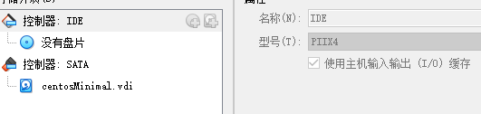

>  前天外面送过来317株不动杆菌,做一些耐药,毒力,进化树常规分析.因为服务器使用十分不方便,自己配置了centos系统各种软件,之后发现当初虚拟盘空间给的不够大,加载了另外一个虚拟盘,挂载操作不当把系统整崩溃了... 从头再来
>
> 2020年6月2日

---

## 系统安装

常规操作[^1]:盘片加载ISO,下面加载虚拟硬盘.



## 网络配置

- 软件设置:NAT;端口转发,外部127.0.0.1:8080访问.

 

- 由于默认网卡不会重启,修改配置文件ONBOOT的no为yes,然后重启.

```bash
vi /etc/sysconfig/network-scrips/ifcfg-en
```

## bash配置

### 终端配色

```
 PS1=&#39;\[\e[33;1m\]\u@\h \[\e[35;1m\]\t \[\e[34;1m\]`pwd`\n\[\e[32;1m\]$ \[\e[0m\]&
```

### 命令别称

```bash
  alias les="less -S"
  alias ll="ls -lh"
  alias ls="ls --color=auto"
  alias wl="wc -l"
```

## yum源配置

- 建议先备份 CentOS-Base.repo

```bash
sudo cp /etc/yum.repos.d/CentOS-Base.repo /etc/yum.repos.d/CentOS-Base.repo.bak
```

- 然后编辑 /etc/yum.repos.d/CentOS-Base.repo 文件，在 mirrorlist= 开头行前面加 # 注释掉；并将 baseurl= 开头行取消注释（如果被注释的话），把该行内的域名（例如mirror.centos.org）替换为 mirrors.tuna.tsinghua.edu.cn。

  > 如果是http开头的,替换成https.

- 最后，更新软件包缓存

```bash
sudo yum makecache
sudo yum update
```

## 必备软件安装

```bash
# yum
sudo yum install wget
# unzip
sudo yum install unzip
#locate
sudo yum install mlocate
updatedb
```

## miniconda安装

## 软件安装

[^1]: 安装过很多次,基本无脑下一步

