Excel数据分析中，我们经常会用到饼状图，今天我们来分享一下复合饼图和双层饼图的制作方法。

01 **复合饼图**  
复合饼图——从主饼图提取部分数值，并将其组合到另一个饼图中。

复合饼图主要有两个作用：

**1.提高小百分比数据的可读性**

在Excel中插入饼图时，有时候会遇到这种情况，饼图中的一些数值占的百分比较小，如果将其放到同一个饼图中（如下图示例），小百分比数据较为密集不易看清。

但小百分比的数据并不一定就是不重要的，很多时候它恰恰可以反映出一些重要问题或信息价值。如何更加清晰体现小百分比数据分布情况呢？

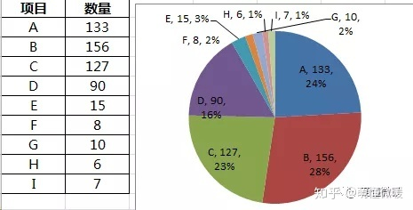

这个时候我们就可以用复合饼图，将小比例项“放大”显示（效果如下图），这样就大大提高了其数据的可读性。

**2.强调一组数据**

工作中我们会碰到这样的情况（如下图），对某一项数据做了二次分析，如何凸显某项数据的细分情况，这个时候我们就可以用复合饼图来实现效果。

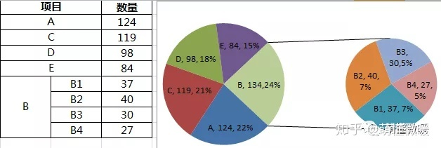

**复合饼图制作步骤**

1.调整数据结构，将所有数据放到同一列或同一行，将需要在第二绘图区显示的数据放到**数据尾端**（也可以将数据降序排列）。

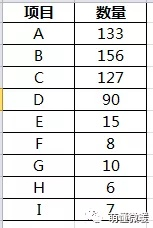

2.选择数据区域，插入饼图，选择所需要的二维饼图的样式。

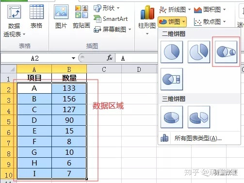

3.选中图表，右键【设置数据序列格式】，根据情况，设置“第二绘图区包含最后几个值”，本案例为5。

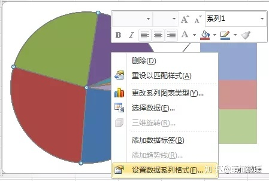
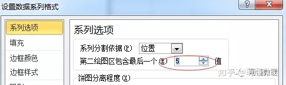

4.选中图表，右键【设置数据标签格式】，选择需要显示的标签选项。

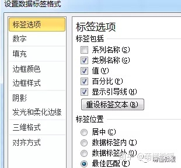

5.最终效果如下，复合饼图就完成了。也可以根据需要，设置图表格式，对其进行美化。

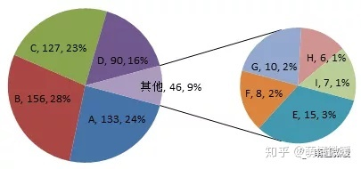

*   **拓展——更改图表类型**

选中图表，右键【更改系列图表类型】，可以根据需要自由选择切换其他图表类型。例如，复合条饼图。

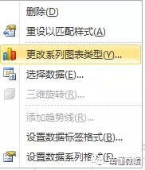
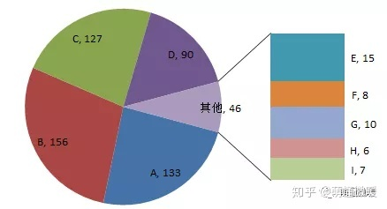

02 **双层饼图**
-----------

如果需要每项数据都显示其细分项数据（如下图），即数据存在**包含**关系时，我们就可以用双层饼图更加直观地展现其数据分布情况。

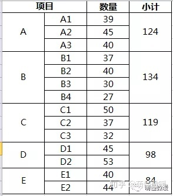

**双层饼图制作步骤**

1.按【ctrl】键，同时选中第一和第四列数据，插入饼图。

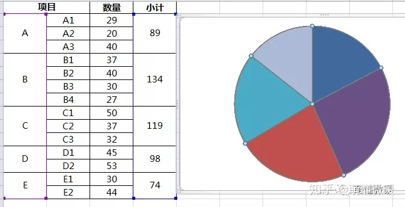

2.选中饼图，右键【选择数据】-添加新系列。

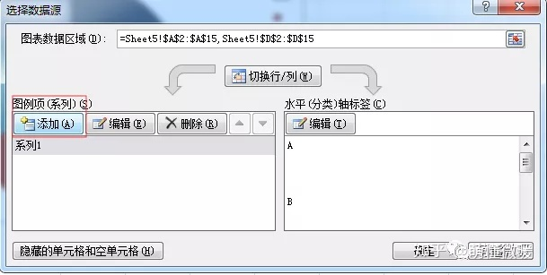

填写系列名称：数量（可以随便填写），系列值——选择第三列数量对应的数据，【确定】。

3.点【编辑】，“轴标签”选中第二列，即细分项名称。

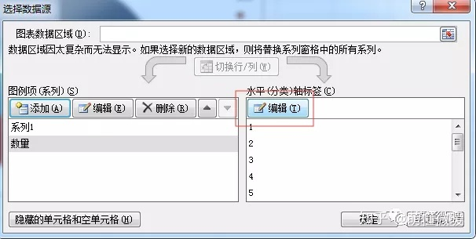
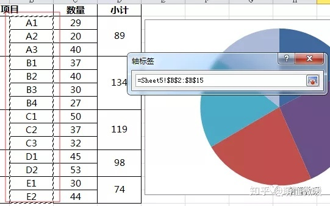

4.选中饼图，右键【设置数据系列格式】。

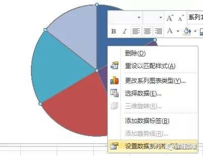

点选【次坐标轴】，设置【饼图分离程度】数值，可根据需要设定，此处设置为：60%。

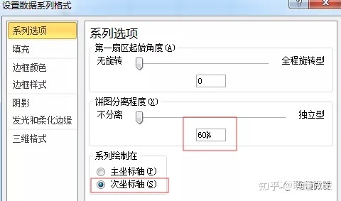

5.选中第一层饼图，调整饼图位置至中心。  

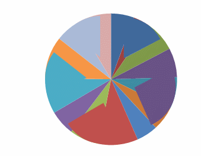

6.设置数据标签，调整饼图样式，让饼图看起来更美观，有层次感。双层饼图制作就完成了。

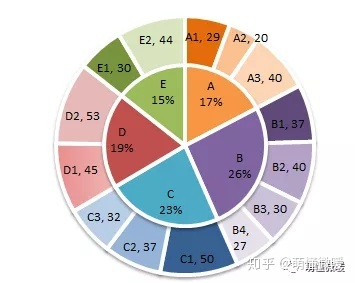
