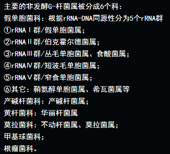

sam

> 使用het_snp_calculator.pl检测bwa生成的bam文件.
>
> 发现需要加载作者自己写的calculator模块,还需要安装moose,class模块.

## 自定义模块

```perl
# 脚本het_snp_calculator.pl添加自定义模块路径
BEGIN { unshift( @INC, '/home/dengqiuyang/vr-codebase/modules/' ) }
```

## CPAN模块安装  ​​

```shell
perl -MCPAN -e shell
# 这一步会将模块安装到~/.cpan目录下,并自动将路径添加到.bashrc,不需要root权限. 
# 有点conda的意思.

cpan>help
cpan>m
cpan>install Moose
cpan>quit

# 遇到的问题:/tmp/build/80754af9/perl_1527832170752/_build_env/bin/x86_64-conda_cos6-linux-gnu-gcc:no such file
# 解决办法:安装指定perl版本
conda install -c conda-forge perl=5.26.2=h470a237_0
```

肠杆菌

| 属         | 常见菌株                   | 形状特点(无芽孢) |
| ---------- | -------------------------- | ---------------- |
| 埃希氏菌   | 大肠杆菌                   | 有荚膜，有鞭毛   |
| 克雷伯氏菌 | 肺炎克雷伯菌               | 有荚膜，无鞭毛   |
| 变形杆菌   | 普通变形杆菌、奇异变形杆菌 | 无荚膜、有鞭毛   |
| 沙门氏菌   | 伤寒沙门氏菌               | 无荚膜，有鞭毛   |
| 志贺氏菌   | 痢疾志贺氏菌               | 无荚膜，无鞭毛   |
| 耶尔森氏菌 | 鼠疫杆菌                   | 无荚膜，有鞭毛   |
| 沙雷氏菌   | 粘质沙雷氏菌               | 无荚膜，有鞭毛   |

非发酵菌

| 属         | 常见菌株         | 形状特点(无芽孢 |
| ---------- | ---------------- | --------------- |
| 不动杆菌   | 鲍曼不动杆菌     |                 |
| 假单胞菌   | 铜绿假单胞菌     |                 |
| 窄食单胞菌 | 嗜麦芽窄食单胞菌 |                 |
| ...        |                  |                 |

 

革兰氏阳性菌

| 代表属       | 常见菌株          |
| ------------ | ----------------- |
| 葡萄球菌     | 金黄色葡萄球菌    |
| 肠球菌       | 屎肠球菌,粪肠球菌 |
| 芽孢杆菌     | 枯草芽孢杆菌      |
| 放线菌**门** | 放线菌...         |
| 链球菌       | 肺炎链球菌        |
| 梭菌         | 艰难梭菌          |
| 李斯特菌     | 李斯特菌          |

