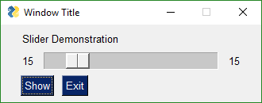
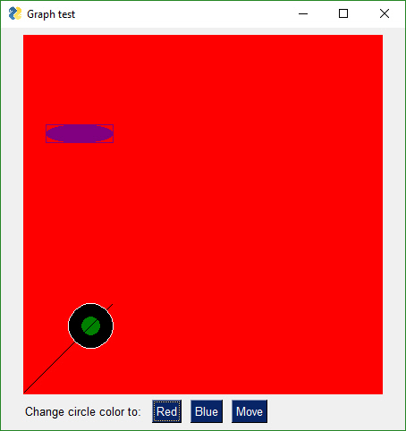

[link](https://www.jianshu.com/u/4302480a3e8e)

*   学习资料：[The PySimpleGUI Cookbook](https://links.jianshu.com/go?to=https%3A%2F%2Fpysimplegui.readthedocs.io%2Fen%2Flatest%2Fcookbook%2F)
*   安装：`pip install PySimpleGUI`

其他的 GUI 工具可以参考：[在这个什么都看脸的时代，如何用 GUI 提高 python 程序的颜值？](https://links.jianshu.com/go?to=https%3A%2F%2Fzhuanlan.zhihu.com%2Fp%2F24865235)

在 PySimpleGUI 中， 小部件(widgets)被称为 元素(elements)。元素的名称与编码中使用的名称保持一致。

```
All of your PySimpleGUI programs will utilize one of these 2 design patterns depending on the type of window you're implementing. The two types of windows are: 1. One-shot window 2. Persistent window

```

Pattern 1: "One-shot Window"
----------------------------

*   该设计模式的窗口特点：read and then closes
*   使用 `sg.Window('Window Title', layout)` 创建

```
from pathlib import Path
import PySimpleGUI as sg

```

```
layout = [[sg.Text('My one-shot window.')],      
                 [sg.InputText()],      
                 [sg.Submit(), sg.Cancel()]]      

window = sg.Window('Window Title', layout)    

event, values = window.Read()    
window.Close()  

text_input = values[0]    
print(text_input)

```

*   `sg.Text`：用来在窗口内的显示文字
*   `sg.InputText`：类似于 python 内置函数 `input`
*   `sg.Submit()`, `sg.Cancel()`：两个按钮，含义自明

Pattern 2：A - Persistent window (multiple reads using an event loop)
--------------------------------------------------------------------

该模式可以实现多次读取

```
layout = [[sg.Text('Persistent window')],      
          [sg.Input(do_not_clear=True)],      
          [sg.Button('Read'), sg.Exit()]]      

window = sg.Window('Window that stays open', layout)      

while True:      
    event, values = window.Read()      
    if event is None or event == 'Exit':      
        break      
    print(event, values)    

window.Close()

```

```
layout = [[sg.Text('Your typed chars appear here:'), sg.Text('', key='_OUTPUT_')],
          [sg.Input(do_not_clear=True, key='_IN_')],
          [sg.Button('Show'), sg.Button('Exit')]]

window = sg.Window('Window Title', layout)

while True:                 
    event, values = window.Read()
    print(event, values)
    if event is None or event == 'Exit':
        break
    if event == 'Show':
        
        window.Element('_OUTPUT_').Update(values['_IN_'])

window.Close()

```

创建一个数据表
-------

```
layout = [
    [sg.Text('Please enter your Name, Address, Phone')],
    [sg.Text('Name', size=(15, 1)), sg.InputText()],
    [sg.Text('Address', size=(15, 1)), sg.InputText()],
    [sg.Text('Phone', size=(15, 1)), sg.InputText()],
    [sg.Submit(), sg.Cancel()]
]

window = sg.Window('Simple data entry window', layout)
event, values = window.Read()
window.Close()
print(event, values[0], values[1], values[2])

```

```


layout = [
    [sg.Text('Please enter your Name, Address, Phone')],
    [sg.Text('Name', size=(15, 1)),
     sg.InputText('Tom', key='_NAME_')],  
    [sg.Text('Address', size=(15, 1)), sg.InputText(
        'address', key='_ADDRESS_')],
    [sg.Text('Phone', size=(15, 1)),
     sg.InputText('phone', key='_PHONE_')],
    [sg.Submit(), sg.Cancel()]
]

window = sg.Window('Simple data entry GUI', layout)

event, values = window.Read()

window.Close()

print(event, values['_NAME_'], values['_ADDRESS_'], values['_PHONE_'])

```

File 浏览器
--------

```
layout = [[sg.Text('SHA-1 and SHA-256 Hashes for the file')],
          [sg.InputText(), sg.FileBrowse()],
          [sg.Submit(), sg.Cancel()]]

with sg.Window('SHA-1 & 256 Hash', layout) as window:
    (event, (source_filename,)) = window.Read()


print(event, source_filename)

```

```
import PySimpleGUI as sg
import sys

if len(sys.argv) == 1:
    event, (fname,) = sg.Window('My Script').Layout([[sg.Text('Document to open')],
                                                     [sg.In(), sg.FileBrowse()],
                                                     [sg.CloseButton('Open'), sg.CloseButton('Cancel')]]).Read()
else:
    fname = sys.argv[1]

if not fname:
    sg.Popup("Cancel", "No filename supplied")
    raise SystemExit("Cancelling: no filename supplied")
print(event, fname)

```

```
layout = [[sg.Text('Enter 2 files to comare')],
          [sg.Text('File 1', size=(8, 1)), sg.InputText(), sg.FileBrowse()],
          [sg.Text('File 2', size=(8, 1)), sg.InputText(), sg.FileBrowse()],
          [sg.Submit(), sg.Cancel()]]

window = sg.Window('File Compare', layout)

event, values = window.Read()
window.Close()
print(event, values)

```

创建可复选的表单
--------

```
def window_op(title, layout):
    with sg.Window(title, layout) as window:
        event, values = window.Read()
    return event, values

```

```
layout = [[sg.Text('Row 1')],
          [sg.Text('Row 2'), sg.Checkbox('Checkbox 1', sg.OK()), sg.Checkbox('Checkbox 2'), sg.OK()]]

```

Checkbox 类型元素返回 `True` 或 `False` 类型的值。由于默认处于未选中状态，两个元素的值都是 `False`。

使用 `sg.Popup('The GUI returned:', button, values)` 替代 `print` 在窗口显示：

```
import PySimpleGUI as sg

sg.ChangeLookAndFeel('GreenTan')  


menu_def = [['File', ['Open', 'Save', 'Exit', 'Properties']],
            ['Edit', ['Paste', ['Special', 'Normal', ], 'Undo'], ],
            ['Help', 'About...'], ]


column1 = [[sg.Text('Column 1', background_color='#F7F3EC', justification='center', size=(10, 1))],
           [sg.Spin(values=('Spin Box 1', '2', '3'),
                    initial_value='Spin Box 1')],
           [sg.Spin(values=('Spin Box 1', '2', '3'),
                    initial_value='Spin Box 2')],
           [sg.Spin(values=('Spin Box 1', '2', '3'), initial_value='Spin Box 3')]]

layout = [
    [sg.Menu(menu_def, tearoff=True)],
    [sg.Text('All graphic widgets in one window!', size=(
        30, 1), justification='center', font=("Helvetica", 25), relief=sg.RELIEF_RIDGE)],
    [sg.Text('Here is some text.... and a place to enter text')],
    [sg.InputText('This is my text')],
    [sg.Frame(layout=[
        [sg.Checkbox('Checkbox', size=(10, 1)),  sg.Checkbox(
            'My second checkbox!', default=True)],
        [sg.Radio('My first Radio!     ', "RADIO1", default=True, size=(10, 1)), sg.Radio('My second Radio!', "RADIO1")]], title='Options', title_color='red', relief=sg.RELIEF_SUNKEN, tooltip='Use these to set flags')],
    [sg.Multiline(default_text='This is the default Text should you decide not to type anything', size=(35, 3)),
     sg.Multiline(default_text='A second multi-line', size=(35, 3))],
    [sg.InputCombo(('Combobox 1', 'Combobox 2'), size=(20, 1)),
     sg.Slider(range=(1, 100), orientation='h', size=(34, 20), default_value=85)],
    [sg.InputOptionMenu(('Menu Option 1', 'Menu Option 2', 'Menu Option 3'))],
    [sg.Listbox(values=('Listbox 1', 'Listbox 2', 'Listbox 3'), size=(30, 3)),
     sg.Frame('Labelled Group', [[
         sg.Slider(range=(1, 100), orientation='v',
                   size=(5, 20), default_value=25),
         sg.Slider(range=(1, 100), orientation='v',
                   size=(5, 20), default_value=75),
         sg.Slider(range=(1, 100), orientation='v',
                   size=(5, 20), default_value=10),
         sg.Column(column1, background_color='#F7F3EC')]])],
    [sg.Text('_' * 80)],
    [sg.Text('Choose A Folder', size=(35, 1))],
    [sg.Text('Your Folder', size=(15, 1), auto_size_text=False, justification='right'),
     sg.InputText('Default Folder'), sg.FolderBrowse()],
    [sg.Submit(tooltip='Click to submit this window'), sg.Cancel()]
]


window = sg.Window('Everything bagel', layout,
                   default_element_size=(40, 1), grab_anywhere=False)

event, values = window.Read()
window.Close()
sg.Popup('Title',
         'The results of the window.',
         'The button clicked was "{}"'.format(event),
         'The values are', values)

```

```
sg.ChangeLookAndFeel('GreenTan')


column1 = [[sg.Text('Column 1', background_color='#d3dfda', justification='center', size=(10,1))],
           [sg.Spin(values=('Spin Box 1', '2', '3'), initial_value='Spin Box 1')],
           [sg.Spin(values=('Spin Box 1', '2', '3'), initial_value='Spin Box 2')],
           [sg.Spin(values=('Spin Box 1', '2', '3'), initial_value='Spin Box 3')]]
layout = [
    [sg.Text('All graphic widgets in one form!', size=(30, 1), font=("Helvetica", 25))],
    [sg.Text('Here is some text.... and a place to enter text')],
    [sg.InputText('This is my text')],
    [sg.Checkbox('My first checkbox!'), sg.Checkbox('My second checkbox!', default=True)],
    [sg.Radio('My first Radio!     ', "RADIO1", default=True), sg.Radio('My second Radio!', "RADIO1")],
    [sg.Multiline(default_text='This is the default Text should you decide not to type anything', size=(35, 3)),
     sg.Multiline(default_text='A second multi-line', size=(35, 3))],
    [sg.InputCombo(('Combobox 1', 'Combobox 2'), size=(20, 3)),
     sg.Slider(range=(1, 100), orientation='h', size=(34, 20), default_value=85)],
    [sg.Listbox(values=('Listbox 1', 'Listbox 2', 'Listbox 3'), size=(30, 3)),
     sg.Slider(range=(1, 100), orientation='v', size=(5, 20), default_value=25),
     sg.Slider(range=(1, 100), orientation='v', size=(5, 20), default_value=75),
     sg.Slider(range=(1, 100), orientation='v', size=(5, 20), default_value=10),
     sg.Column(column1, background_color='#d3dfda')],
    [sg.Text('_'  * 80)],
    [sg.Text('Choose A Folder', size=(35, 1))],
    [sg.Text('Your Folder', size=(15, 1), auto_size_text=False, justification='right'),
     sg.InputText('Default Folder'), sg.FolderBrowse()],
    [sg.Submit(), sg.Cancel()]
     ]
form = sg.FlexForm('Everything bagel', layout, default_element_size=(40, 1))
button, values = form.Read()
form.Close()
sg.Popup(button, values)

```

为你的程序或脚本添加 GUI
--------------

如果你有一个命令行方式使用的脚本，添加 GUI 不一定意味着完全放弃该脚本。一种简单的方案如下：如果脚本不需要命令行参数，那么可以直接使用 GUI 调用该脚本；反之，就按原来的方式运行脚本。  
仅需类似如下的逻辑：

```
if len(sys.argv) == 1:
    
else:
    
    

```

下面的例子的详解请参考：[The PySimpleGUI Cookbook](https://links.jianshu.com/go?to=https%3A%2F%2Fpysimplegui.readthedocs.io%2Fen%2Flatest%2Fcookbook%2F)

更多的例子
-----

下面的例子列举出来，只是为了复制方便，因为官方提供的有部分格式问题：

```
layout = [[sg.Text('Stopwatch', size=(20, 2), justification='center')],
            [sg.Text('', size=(10, 2), font=('Helvetica', 20), justification='center', key='_OUTPUT_')],
            [sg.T(' ' * 5), sg.Button('Start/Stop', focus=True), sg.Quit()]]

window = sg.Window('Running Timer', layout)

timer_running = True
i = 0

while True:
    i += 1 * (timer_running is True)
    event, values = window.Read(timeout=10) 
    if event is None or event == 'Quit':  
        break
    elif event == 'Start/Stop':
        timer_running = not timer_running
    window.Element('_OUTPUT_').Update('{:02d}:{:02d}.{:02d}'.format((i // 100) // 60, (i // 100) % 60, i % 100))
    
window.Close()

```

```
import PySimpleGUI as sg

def button1():
    print('Button 1 callback')

def button2():
    print('Button 2 callback')

layout = [[sg.Text('Please click a button', auto_size_text=True)],
          [sg.Button('1'), sg.Button('2'), sg.Quit()]]

window = sg.Window('Button callback example', layout)

while True:  
    event, value = window.Read()    
    if event == '1':
        button1()
    elif event == '2':
        button2()
    elif event == 'Quit' or event is None:
        window.Close()
        break
window.Close()
sg.PopupOK('Done')

```

```
import PySimpleGUI as sg

layout = [[sg.Text('Robotics Remote Control')],
          [sg.T(' ' * 10), sg.RealtimeButton('Forward')],
          [sg.RealtimeButton('Left'), sg.T(' ' * 15),
           sg.RealtimeButton('Right')],
          [sg.T(' ' * 10), sg.RealtimeButton('Reverse')],
          [sg.T('')],
          [sg.Quit(button_color=('black', 'orange'))]
          ]

window = sg.Window('Robotics Remote Control', layout, auto_size_text=True)

while (True):
    
    event, values = window.Read(timeout=10)
    if event is not None:
        print(event)
    if event == 'Quit' or values is None:
        break

window.Close()   

```

```
import PySimpleGUI as sg

for i in range(1000):
    sg.OneLineProgressMeter('One Line Meter Example', i+1, 1000, 'key')

```

```
import sys
if sys.version_info[0] >= 3:
    import PySimpleGUI as sg
else:
    import PySimpleGUI27 as sg

def MediaPlayerGUI():
    background = '#F0F0F0'
    
    sg.SetOptions(background_color=background,
                  element_background_color=background)
    
    image_pause = './ButtonGraphics/Pause.png'
    image_restart = './ButtonGraphics/Restart.png'
    image_next = './ButtonGraphics/Next.png'
    image_exit = './ButtonGraphics/Exit.png'
    
    layout = [[sg.Text('Media File Player', size=(17, 1), font=("Helvetica", 25))],
              [sg.Text('', size=(15, 2), font=("Helvetica", 14), key='output')],
              [sg.Button('', button_color=(background, background),
                         image_filename=image_restart, image_size=(50, 50), image_subsample=2, border_width=0, key='Restart Song'),
               sg.Text(' ' * 2),
               sg.Button('', button_color=(background, background),
                         image_filename=image_pause, image_size=(50, 50), image_subsample=2, border_width=0, key='Pause'),
               sg.Text(' ' * 2),
               sg.Button('', button_color=(background, background), image_filename=image_next, image_size=(
                   50, 50), image_subsample=2, border_width=0, key='Next'),
               sg.Text(' ' * 2),
               sg.Text(' ' * 2), sg.Button('', button_color=(background, background),
                                           image_filename=image_exit, image_size=(50, 50), image_subsample=2, border_width=0, key='Exit')],
              [sg.Text('_'*20)],
              [sg.Text(' '*30)],
              [
        sg.Slider(range=(-10, 10), default_value=0, size=(10, 20),
                  orientation='vertical', font=("Helvetica", 15)),
        sg.Text(' ' * 2),
        sg.Slider(range=(-10, 10), default_value=0, size=(10, 20),
                  orientation='vertical', font=("Helvetica", 15)),
        sg.Text(' ' * 2),
        sg.Slider(range=(-10, 10), default_value=0, size=(10, 20), orientation='vertical', font=("Helvetica", 15))],
        [sg.Text('   Bass', font=("Helvetica", 15), size=(9, 1)),
         sg.Text('Treble', font=("Helvetica", 15), size=(7, 1)),
         sg.Text('Volume', font=("Helvetica", 15), size=(7, 1))]
    ]

    
    window = sg.Window('Media File Player', layout, auto_size_text=True, default_element_size=(20, 1),
                       font=("Helvetica", 25))
    
    while(True):
        event, values = window.Read(timeout=100)        
        if event == 'Exit' or event is None:
            break
        
        if event != sg.TIMEOUT_KEY:
            window.Element('output').Update(event)


MediaPlayerGUI()
window.Close()   

```

```
import PySimpleGUI as sg
import subprocess

def ExecuteCommandSubprocess(command, *args):
    try:
        sp = subprocess.Popen([command, *args], shell=True,
                              stdout=subprocess.PIPE, stderr=subprocess.PIPE)
        out, err = sp.communicate()
        if out:
            print(out.decode("utf-8"))
        if err:
            print(err.decode("utf-8"))
    except:
        pass

layout = [
    [sg.Text('Script output....', size=(40, 1))],
    [sg.Output(size=(88, 20))],
    [sg.Button('script1'), sg.Button('script2'), sg.Button('EXIT')],
    [sg.Text('Manual command', size=(15, 1)), sg.InputText(
        focus=True), sg.Button('Run', bind_return_key=True)]
]

window = sg.Window('Script launcher', layout)

while True:
    (event, value) = window.Read()
    if event == 'EXIT' or event is None:
        break  
    if event == 'script1':
        ExecuteCommandSubprocess('pip', 'list')
    elif event == 'script2':
        ExecuteCommandSubprocess('python', '--version')
    elif event == 'Run':
        ExecuteCommandSubprocess(value[0])
        
window.Close()   

```

```
import subprocess
import PySimpleGUI as sg

CHROME = r"C:\Program Files (x86)\Google\Chrome\Application\chrome.exe"


layout = [[sg.Text('Text area', key='_TEXT_')],
          [sg.Input(do_not_clear=True, key='_URL_')],
          [sg.Button('Chrome'), sg.Button('Exit')]]

window = sg.Window('Window Title', layuout)

while True:             
    event, values = window.Read()
    print(event, values)
    if event is None or event == 'Exit':
        break
    if event == 'Chrome':
        sp = subprocess.Popen([CHROME, values['_URL_']], shell=True,
                              stdout=subprocess.PIPE, stderr=subprocess.PIPE)

window.Close()

```

```
import PySimpleGUI as sg


sg.ChangeLookAndFeel('GreenTan')

sg.SetOptions(text_justification='right')

layout = [[sg.Text('Machine Learning Command Line Parameters', font=('Helvetica', 16))],
          [sg.Text('Passes', size=(15, 1)), sg.Spin(values=[i for i in range(1, 1000)], initial_value=20, size=(6, 1)),
           sg.Text('Steps', size=(18, 1)), sg.Spin(values=[i for i in range(1, 1000)], initial_value=20, size=(6, 1))],
          [sg.Text('ooa', size=(15, 1)), sg.In(default_text='6', size=(10, 1)), sg.Text('nn', size=(15, 1)),
           sg.In(default_text='10', size=(10, 1))],
          [sg.Text('q', size=(15, 1)), sg.In(default_text='ff', size=(10, 1)), sg.Text('ngram', size=(15, 1)),
           sg.In(default_text='5', size=(10, 1))],
          [sg.Text('l', size=(15, 1)), sg.In(default_text='0.4', size=(10, 1)), sg.Text('Layers', size=(15, 1)),
           sg.Drop(values=('BatchNorm', 'other'), auto_size_text=True)],
          [sg.Text('_' * 100, size=(65, 1))],
          [sg.Text('Flags', font=('Helvetica', 15), justification='left')],
          [sg.Checkbox('Normalize', size=(12, 1), default=True),
           sg.Checkbox('Verbose', size=(20, 1))],
          [sg.Checkbox('Cluster', size=(12, 1)), sg.Checkbox(
              'Flush Output', size=(20, 1), default=True)],
          [sg.Checkbox('Write Results', size=(12, 1)), sg.Checkbox(
              'Keep Intermediate Data', size=(20, 1))],
          [sg.Text('_' * 100, size=(65, 1))],
          [sg.Text('Loss Functions', font=(
              'Helvetica', 15), justification='left')],
          [sg.Radio('Cross-Entropy', 'loss', size=(12, 1)),
           sg.Radio('Logistic', 'loss', default=True, size=(12, 1))],
          [sg.Radio('Hinge', 'loss', size=(12, 1)),
           sg.Radio('Huber', 'loss', size=(12, 1))],
          [sg.Radio('Kullerback', 'loss', size=(12, 1)),
           sg.Radio('MAE(L1)', 'loss', size=(12, 1))],
          [sg.Radio('MSE(L2)', 'loss', size=(12, 1)),
           sg.Radio('MB(L0)', 'loss', size=(12, 1))],
          [sg.Submit(), sg.Cancel()]]

window = sg.Window('Machine Learning Front End',
                   layout, font=("Helvetica", 12))

event, values = window.Read()
window.Close()

```

```
import PySimpleGUI as sg


layout = [[sg.Text('A custom progress meter')],
          [sg.ProgressBar(1000, orientation='h', size=(20, 20), key='progbar')],
          [sg.Cancel()]]


window = sg.Window('Custom Progress Meter', layout)

for i in range(1000):
    
    event, values = window.Read(timeout=0)
    if event == 'Cancel' or event is None:
        break
        
    window.Element('progbar').UpdateBar(i + 1)

window.Close()

```

### The One-Line GUI

```python
import PySimpleGUI as sg      

layout = [[sg.Text('Filename')],      
              [sg.Input(), sg.FileBrowse()],      
              [sg.OK(), sg.Cancel()]]      

window = sg.Window('Get filename example', layout)
event, (number,) = window.Read() 
window.Close()

```

```python
import PySimpleGUI as sg     
sg.ChangeLookAndFeel('BlueMono')      

col = [[sg.Text('col Row 1', text_color='white', background_color='blue')],      
           [sg.Text('col Row 2', text_color='white', background_color='blue'), sg.Input('col input 1')],      
           [sg.Text('col Row 3', text_color='white', background_color='blue'), sg.Input('col input 2')]]      

layout = [[sg.Listbox(values=('Listbox Item 1', 'Listbox Item 2', 'Listbox Item 3'), select_mode=sg.LISTBOX_SELECT_MODE_MULTIPLE, size=(20,3)), sg.Column(col, background_color='blue')],      
              [sg.Input('Last input')],      
              [sg.OK()]]      

window = sg.Window('Compact 1-line Window with column', layout)
event, values = window.Read()  
window.Close()
sg.Popup(event, values, line_width=200) 

```

```
import PySimpleGUI as sg    
layout = [[sg.Txt('Enter values to calculate')],
          [sg.In(size=(8, 1), key='numerator')],
          [sg.Txt('_' * 10)],
          [sg.In(size=(8, 1), key='denominator')],
          [sg.Txt('', size=(8, 1), key='output')],
          [sg.Button('Calculate', bind_return_key=True)]]

window = sg.Window('Math', layout)

while True:
    event, values = window.Read()

    if event is not None:
        try:
            numerator = float(values['numerator'])
            denominator = float(values['denominator'])
            calc = numerator / denominator
        except:
            calc = 'Invalid'

        window.Element('output').Update(calc)
    else:
        break

window.Close()

```

One Element Updating Another - Compound Elements
------------------------------------------------



image

You can easily build "compound elements" in a single like of code. This recipe shows you how to add a numeric value onto a slider.

```
import PySimpleGUI as sg

layout = [[sg.Text('Slider Demonstration'), sg.Text('', key='_OUTPUT_')],
          [sg.T('0', key='_LEFT_'),
           sg.Slider((1, 100), key='_SLIDER_', orientation='h',
                     enable_events=True, disable_number_display=True),
           sg.T('0', key='_RIGHT_')],
          [sg.Button('Show'), sg.Button('Exit')]]

window = sg.Window('Window Title', layout)

while True:             
    event, values = window.Read()
    print(event, values)
    if event is None or event == 'Exit':
            break
    window.Element('_LEFT_').Update(values['_SLIDER_'])
    window.Element('_RIGHT_').Update(values['_SLIDER_'])

window.Close()

```

### Multiple Windows

This recipe is a design pattern for multiple windows where the first window is not active while the second window is showing. The first window is hidden to discourage continued interaction.

```
"""
 PySimpleGUI The Complete Course Lesson 7 - Multiple Windows"""
import PySimpleGUI as sg


layout = [[sg.Text('Window 1'), ],
          [sg.Input(do_not_clear=True)],
          [sg.Text('', key='_OUTPUT_')],
          [sg.Button('Launch 2')]]

win1 = sg.Window('Window 1', layout)
win2_active = False
while True:
    ev1, vals1 = win1.Read(timeout=100)
    if ev1 is None:
        break
    win1.Element('_OUTPUT_').Update(vals1[0])

    if ev1 == 'Launch 2' and not win2_active:
        win2_active = True
    win1.Hide()
    layout2 = [[sg.Text('Window 2')],       
               [sg.Button('Exit')]]

    win2 = sg.Window('Window 2', layout2)
    while True:
        ev2, vals2 = win2.Read()
        if ev2 is None or ev2 == 'Exit':
            win2.Close()
            win2_active = False
        win1.UnHide()
        break

```

### tkinter Canvas Widget

```
import PySimpleGUI as sg
layout = [      
    [sg.Canvas(size=(100, 100), background_color='red', key= 'canvas')],      
    [sg.T('Change circle color to:'), sg.Button('Red'), sg.Button('Blue')]      
    ]

window = sg.Window('Canvas test', layout)      
window.Finalize()

canvas = window.Element('canvas')      
cir = canvas.TKCanvas.create_oval(50, 50, 100, 100)

while True:      
    event, values = window.Read()      
    if event is None:      
        break      
    if event == 'Blue':      
        canvas.TKCanvas.itemconfig(cir, fill="Blue")      
    elif event == 'Red':      
        canvas.TKCanvas.itemconfig(cir, fill="Red")

```

### Graph Element - drawing circle, rectangle, etc, objects

Just like you can draw on a tkinter widget, you can also draw on a Graph Element. Graph Elements are easier on the programmer as you get to work in your own coordinate system.



graph recipe

```
import PySimpleGUI as sg

layout = [
    [sg.Graph(canvas_size=(400, 400), graph_bottom_left=(0, 0),
              graph_top_right=(400, 400), background_color='red', key='graph')],
    [sg.T('Change circle color to:'), sg.Button(
        'Red'), sg.Button('Blue'), sg.Button('Move')]
]

window = sg.Window('Graph test', layout)
window.Finalize()

graph = window.Element('graph')
circle = graph.DrawCircle((75, 75), 25, fill_color='black', line_color='white')
point = graph.DrawPoint((75, 75), 10, color='green')
oval = graph.DrawOval((25, 300), (100, 280),
                      fill_color='purple', line_color='purple')
rectangle = graph.DrawRectangle((25, 300), (100, 280), line_color='purple')
line = graph.DrawLine((0, 0), (100, 100))

while True:
    event, values = window.Read()
    if event is None:
        break
    if event is 'Blue':
        graph.TKCanvas.itemconfig(circle, fill="Blue")
    elif event is 'Red':
        graph.TKCanvas.itemconfig(circle, fill="Red")
    elif event is 'Move':
        graph.MoveFigure(point, 10, 10)
        graph.MoveFigure(circle, 10, 10)
        graph.MoveFigure(oval, 10, 10)
        graph.MoveFigure(rectangle, 10, 10)

```

### Keypad Touchscreen Entry - Input Element Update

```
import PySimpleGUI as sg


layout = [[sg.Text('Enter Your Passcode')],
          [sg.Input(size=(10, 1), do_not_clear=True,
                    justification='right', key='input')],
          [sg.Button('1'), sg.Button('2'), sg.Button('3')],
          [sg.Button('4'), sg.Button('5'), sg.Button('6')],
          [sg.Button('7'), sg.Button('8'), sg.Button('9')],
          [sg.Button('Submit'), sg.Button('0'), sg.Button('Clear')],
          [sg.Text('', size=(15, 1), font=('Helvetica', 18),
                   text_color='red', key='out')],
          ]

window = sg.Window('Keypad', layout, default_button_element_size=(
    5, 2), auto_size_buttons=False, grab_anywhere=False)


keys_entered = ''
while True:
    event, values = window.Read()  
    if event is None:  
        break
    if event == 'Clear':  
        keys_entered = ''
    elif event in '1234567890':
        keys_entered = values['input']  
        keys_entered += event  
    elif event == 'Submit':
        keys_entered = values['input']
        window.Element('out').Update(keys_entered)  

    
    window.Element('input').Update(keys_entered)

```

<iframe height="800px" width="100%" src="https://repl.it/@PySimpleGUI/Cookbook-Keypad-Touchscreen-Entry?lite=true" scrolling="no" frameborder="no" allowtransparency="true" allowfullscreen="true" sandbox="allow-forms allow-pointer-lock allow-popups allow-same-origin allow-scripts allow-modals"></iframe>

Animated Matplotlib Graph
-------------------------

Use the Canvas Element to create an animated graph. The code is a bit tricky to follow, but if you know Matplotlib then this recipe shouldn't be too difficult to copy and modify.

\[图片上传失败...(image-b68998-1563439321791)\]

```
from tkinter import *
from random import randint
import PySimpleGUI as sg
from matplotlib.backends.backend_tkagg import FigureCanvasTkAgg, FigureCanvasAgg
from matplotlib.figure import Figure
import matplotlib.backends.tkagg as tkagg
import tkinter as Tk

fig = Figure()

ax = fig.add_subplot(111)
ax.set_xlabel("X axis")
ax.set_ylabel("Y axis")
ax.grid()

layout = [[sg.Text('Animated Matplotlib', size=(40, 1), justification='center', font='Helvetica 20')],
          [sg.Canvas(size=(640, 480), key='canvas')],
          [sg.Button('Exit', size=(10, 2), pad=((280, 0), 3), font='Helvetica 14')]]


window = sg.Window(
    'Demo Application - Embedding Matplotlib In PySimpleGUI', layout)
window.Finalize()  

canvas_elem = window.Element('canvas')

graph = FigureCanvasTkAgg(fig, master=canvas_elem.TKCanvas)
canvas = canvas_elem.TKCanvas

dpts = [randint(0, 10) for x in range(10000)]

for i in range(len(dpts)):
    event, values = window.Read(timeout=20)
    if event == 'Exit' or event is None:
        exit(69)

    ax.cla()
    ax.grid()

    ax.plot(range(20), dpts[i:i + 20], color='purple')
    graph.draw()
    figure_x, figure_y, figure_w, figure_h = fig.bbox.bounds
    figure_w, figure_h = int(figure_w), int(figure_h)
    photo = Tk.PhotoImage(master=canvas, width=figure_w, height=figure_h)

    canvas.create_image(640 / 2, 480 / 2, image=photo)

    figure_canvas_agg = FigureCanvasAgg(fig)
    figure_canvas_agg.draw()

    tkagg.blit(photo, figure_canvas_agg.get_renderer()._renderer, colormode=2)

```

### Tight Layout with Button States

```
import PySimpleGUI as sg
"""
    Demonstrates using a "tight" layout with a Dark theme.
    Shows how button states can be controlled by a user application.  The program manages the disabled/enabled
    states for buttons and changes the text color to show greyed-out (disabled) buttons
    """

sg.ChangeLookAndFeel('Dark')
sg.SetOptions(element_padding=(0, 0))

layout = [[sg.T('User:', pad=((3, 0), 0)), sg.OptionMenu(values=('User 1', 'User 2'), size=(20, 1)), sg.T('0', size=(8, 1))],
          [sg.T('Customer:', pad=((3, 0), 0)), sg.OptionMenu(
              values=('Customer 1', 'Customer 2'), size=(20, 1)), sg.T('1', size=(8, 1))],
          [sg.T('Notes:', pad=((3, 0), 0)), sg.In(size=(44, 1),
                                                  background_color='white', text_color='black')],
          [sg.Button('Start', button_color=('white', 'black'), key='Start'),
           sg.Button('Stop', button_color=('white', 'black'), key='Stop'),
           sg.Button('Reset', button_color=(
               'white', 'firebrick3'), key='Reset'),
           sg.Button('Submit', button_color=('white', 'springgreen4'), key='Submit')]
          ]

window = sg.Window("Time Tracker", layout, default_element_size=(12, 1), text_justification='r', auto_size_text=False, auto_size_buttons=False,
                   default_button_element_size=(12, 1))
window.Finalize()
window.Element('Stop').Update(disabled=True)
window.Element('Reset').Update(disabled=True)
window.Element('Submit').Update(disabled=True)
recording = have_data = False
while True:
    event, values = window.Read()
    print(event)
    if event is None:
        exit(69)
    if event is 'Start':
        window.Element('Start').Update(disabled=True)
        window.Element('Stop').Update(disabled=False)
        window.Element('Reset').Update(disabled=False)
        window.Element('Submit').Update(disabled=True)
        recording = True
    elif event is 'Stop' and recording:
        window.Element('Stop').Update(disabled=True)
        window.Element('Start').Update(disabled=False)
        window.Element('Submit').Update(disabled=False)
        recording = False
        have_data = True
    elif event is 'Reset':
        window.Element('Stop').Update(disabled=True)
        window.Element('Start').Update(disabled=False)
        window.Element('Submit').Update(disabled=True)
        window.Element('Reset').Update(disabled=False)
        recording = False
        have_data = False
    elif event is 'Submit' and have_data:
        window.Element('Stop').Update(disabled=True)
        window.Element('Start').Update(disabled=False)
        window.Element('Submit').Update(disabled=True)
        window.Element('Reset').Update(disabled=False)
        recording = False

```

### Password Protection For Scripts

You get 2 scripts in one.  
Use the upper half to generate your hash code. Then paste it into the code in the lower half. Copy and paste lower 1/2 into your code to get password protection for your script without putting the password into your source code.

```
import PySimpleGUI as sg
import hashlib

'''
         Create a secure login for your scripts without having to include your password    in the program.  Create an SHA1 hash code for your password using the GUI. Paste into variable in final program
         1. Choose a password
         2. Generate a hash code for your chosen password by running program and entering 'gui' as the password
         3. Type password into the GUI
         4. Copy and paste hash code Window GUI into variable named login_password_hash
         5. Run program again and test your login!
    '''


def HashGeneratorGUI():
    layout = [[sg.T('Password Hash Generator', size=(30, 1), font='Any 15')],
              [sg.T('Password'), sg.In(key='password')],
              [sg.T('SHA Hash'), sg.In('', size=(40, 1), key='hash')],
              ]

    window = sg.Window('SHA Generator', layout, auto_size_text=False, default_element_size=(10, 1),
                       text_justification='r', return_keyboard_events=True, grab_anywhere=False)

    while True:
        event, values = window.Read()
        if event is None:
            exit(69)

        password = values['password']
        try:
            password_utf = password.encode('utf-8')
            sha1hash = hashlib.sha1()
            sha1hash.update(password_utf)
            password_hash = sha1hash.hexdigest()
            window.Element('hash').Update(password_hash)
        except:
            pass

    
    


def PasswordMatches(password, hash):
    password_utf = password.encode('utf-8')
    sha1hash = hashlib.sha1()
    sha1hash.update(password_utf)
    password_hash = sha1hash.hexdigest()
    if password_hash == hash:
        return True
    else:
        return False


login_password_hash = '5baa61e4c9b93f3f0682250b6cf8331b7ee68fd8'
password = sg.PopupGetText('Password', password_char='*')
if password == 'gui':                
    HashGeneratorGUI()               
    exit(69)                         
if PasswordMatches(password, login_password_hash):
    print('Login SUCCESSFUL')
else:
    print('Login FAILED!!')

```

### Desktop Floating Toolbar

```
import PySimpleGUI as sg
import subprocess
import os
import sys
"""
Demo_Toolbar - A floating toolbar with quick launcher    
One cool PySimpleGUI demo. Shows borderless windows, grab_anywhere, tight button layout
You can setup a specific program to launch when a button is clicked, 
or use the Combobox to select a .py file found in the root folder, and run that file. 
"""

ROOT_PATH = './'


def Launcher():
    def print(line):
        window.Element('output').Update(line)

    sg.ChangeLookAndFeel('Dark')

    namesonly = [f for f in os.listdir(ROOT_PATH) if f.endswith('.py')]

    sg.SetOptions(element_padding=(0, 0), button_element_size=(
        12, 1), auto_size_buttons=False)
    layout = [[sg.Combo(values=namesonly, size=(35, 30), key='demofile'),
               sg.Button('Run', button_color=('white', '#00168B')),
               sg.Button('Program 1'),
               sg.Button('Program 2'),
               sg.Button('Program 3', button_color=('white', '#35008B')),
               sg.Button('EXIT', button_color=('white', 'firebrick3'))],
              [sg.T('', text_color='white', size=(50, 1), key='output')]]

    window = sg.Window('Floating Toolbar', layout,
                       no_titlebar=True, keep_on_top=True)

    
    while True:
        (event, value) = window.Read()
        if event == 'EXIT' or event is None:
            break  
        if event == 'Program 1':
            print('Run your program 1 here!')
        elif event == 'Program 2':
            print('Run your program 2 here!')
        elif event == 'Run':
            file = value['demofile']
            print('Launching %s' % file)
            ExecuteCommandSubprocess(
                'python', os.path.join(ROOT_PATH, file))
        else:
            print(event)


def ExecuteCommandSubprocess(command, *args, wait=False):
    try:
        if sys.platwindow == 'linux':
            arg_string = ''
            for arg in args:
                arg_string += ' ' + str(arg)
            sp = subprocess.Popen(
                ['python3' + arg_string, ], shell=True, stdout=subprocess.PIPE, stderr=subprocess.PIPE)
        else:
            sp = subprocess.Popen([command, list(
                args)], shell=True, stdout=subprocess.PIPE, stderr=subprocess.PIPE)

        if wait:
            out, err = sp.communicate()
            if out:
                print(out.decode("utf-8"))
            if err:
                print(err.decode("utf-8"))
    except:
        pass


if __name__ == '__main__':
    Launcher()

```

### Desktop Floating Widget - Timer

```
import time
import sys
if sys.version_info[0] >= 3:
    import PySimpleGUI as sg
else:
    import PySimpleGUI27 as sg

"""
 Timer Desktop Widget Creates a floating timer that is always on top of other windows You move it by grabbing anywhere on the window Good example of how to do a non-blocking, polling program using SimpleGUI Can be used to poll hardware when running on a Pi

 While the timer ticks are being generated by PySimpleGUI's "timeout" mechanism, the actual value
  of the timer that is displayed comes from the system timer, time.time().  This guarantees an
  accurate time value is displayed regardless of the accuracy of the PySimpleGUI timer tick. If
  this design were not used, then the time value displayed would slowly drift by the amount of time
  it takes to execute the PySimpleGUI read and update calls (not good!)     

 NOTE - you will get a warning message printed when you exit using exit button.
 It will look something like: invalid command name \"1616802625480StopMove\"
"""


sg.ChangeLookAndFeel('Black')
sg.SetOptions(element_padding=(0, 0))

layout = [[sg.Text('')],
          [sg.Text('', size=(8, 2), font=('Helvetica', 20),
                   justification='center', key='text')],
          [sg.Button('Pause', key='button', button_color=('white', '#001480')),
           sg.Button('Reset', button_color=('white', '#007339'), key='Reset'),
           sg.Exit(button_color=('white', 'firebrick4'), key='Exit')]]

window = sg.Window('Running Timer', layout, no_titlebar=True,
                   auto_size_buttons=False, keep_on_top=True, grab_anywhere=True)


current_time = 0
paused = False
start_time = int(round(time.time() * 100))
while (True):
    
    if not paused:
        event, values = window.Read(timeout=10)
        current_time = int(round(time.time() * 100)) - start_time
    else:
        event, values = window.Read()
    if event == 'button':
        event = window.Element(event).GetText()
    
    if event is None or event == 'Exit':        
        break
    if event is 'Reset':
        start_time = int(round(time.time() * 100))
        current_time = 0
        paused_time = start_time
    elif event == 'Pause':
        paused = True
        paused_time = int(round(time.time() * 100))
        element = window.Element('button')
        element.Update(text='Run')
    elif event == 'Run':
        paused = False
        start_time = start_time + int(round(time.time() * 100)) - paused_time
        element = window.Element('button')
        element.Update(text='Pause')

    
    window.Element('text').Update('{:02d}:{:02d}.{:02d}'.format((current_time // 100) // 60,
                                                                (current_time //
                                                                 100) % 60,
                                                                current_time % 100))

```

### Desktop Floating Widget - CPU Utilization

```
import PySimpleGUI as sg
import psutil


sg.ChangeLookAndFeel('Black')
layout = [[sg.Text('')],
          [sg.Text('', size=(8, 2), font=('Helvetica', 20),
                   justification='center', key='text')],
          [sg.Exit(button_color=('white', 'firebrick4'), pad=((15, 0), 0)),
           sg.Spin([x + 1 for x in range(10)], 1, key='spin')]]

window = sg.Window('Running Timer', layout, no_titlebar=True, auto_size_buttons=False, keep_on_top=True,
                   grab_anywhere=True)


while (True):
    
    event, values = window.Read(timeout=0)

    
    if event is None or event == 'Exit':
        break
    try:
        interval = int(values['spin'])
    except:
        interval = 1

    cpu_percent = psutil.cpu_percent(interval=interval)

    

    window.Element('text').Update(f'CPU {cpu_percent:02.0f}%')


window.Close()

```

### Menus

Menus are nothing more than buttons that live in a menu-bar. When you click on a menu item, you get back a "button" with that menu item's text, just as you would had that text been on a button.  
Menu's are defined separately from the GUI window. To add one to your window, simply insert sg.Menu(menu\_layout). The menu definition is a list of menu choices and submenus. They are a list of lists. Copy the Recipe and play with it. You'll eventually get when you're looking for.  
If you double click the dashed line at the top of the list of choices, that menu will tear off and become a floating toolbar. How cool! To enable this feature, set the parameter tearoff=True in your call to sg.Menu()

```
import PySimpleGUI as sg

sg.ChangeLookAndFeel('LightGreen')
sg.SetOptions(element_padding=(0, 0))


menu_def = [['File', ['Open', 'Save', 'Exit']],
            ['Edit', ['Paste', ['Special', 'Normal', ], 'Undo'], ],
            ['Help', 'About...'], ]


layout = [
    [sg.Menu(menu_def, )],
    [sg.Output(size=(60, 20))]
]

window = sg.Window("Windows-like program", layout, default_element_size=(12, 1), auto_size_text=False, auto_size_buttons=False,
                   default_button_element_size=(12, 1))


while True:
    event, values = window.Read()
    if event == None or event == 'Exit':
        break
    print('Button = ', event)
    
    if event == 'About...':
        sg.Popup('About this program', 'Version 1.0', 'PySimpleGUI rocks...')
    elif event == 'Open':
        filename = sg.PopupGetFile('file to open', no_window=True)
        print(filename)

```

### Graphing with Graph Element

Use the Graph Element to draw points, lines, circles, rectangles using your coordinate systems rather than the underlying graphics coordinates.  
In this example we're defining our graph to be from -100, -100 to +100,+100. That means that zero is in the middle of the drawing. You define this graph description in your call to Graph.

```
import math
import PySimpleGUI as sg

layout = [[sg.Graph(canvas_size=(400, 400), graph_bottom_left=(-105, -105), graph_top_right=(
    105, 105), background_color='white', key='graph', tooltip='This is a cool graph!')], ]

window = sg.Window('Graph of Sine Function', layout,
                   grab_anywhere=True).Finalize()
graph = window.Element('graph')


graph.DrawLine((-100, 0), (100, 0))
graph.DrawLine((0, -100), (0, 100))

for x in range(-100, 101, 20):
    graph.DrawLine((x, -3), (x, 3))
    if x != 0:
        graph.DrawText(x, (x, -10), color='green')

for y in range(-100, 101, 20):
    graph.DrawLine((-3, y), (3, y))
    if y != 0:
        graph.DrawText(y, (-10, y), color='blue')


for x in range(-100, 100):
    y = math.sin(x/20)*50
    graph.DrawCircle((x, y), 1, line_color='red', fill_color='red')

event, values = window.Read()
window.Close()

```

### Tabs

```
import PySimpleGUI as sg

tab1_layout = [[sg.T('This is inside tab 1')]]

tab2_layout = [[sg.T('This is inside tab 2')],
               [sg.In(key='in')]]

layout = [[sg.TabGroup([[sg.Tab('Tab 1', tab1_layout, tooltip='tip'), sg.Tab('Tab 2', tab2_layout)]], tooltip='TIP2')],
          [sg.Button('Read')]]

window = sg.Window('My window with tabs', layout, default_element_size=(12, 1))

while True:
    event, values = window.Read()
    print(event, values)
    if event is None:           
        break
        
window.Close()

```

​    