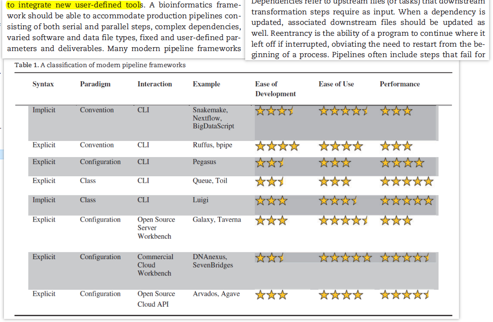
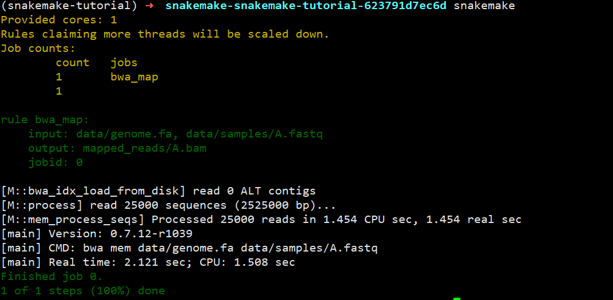
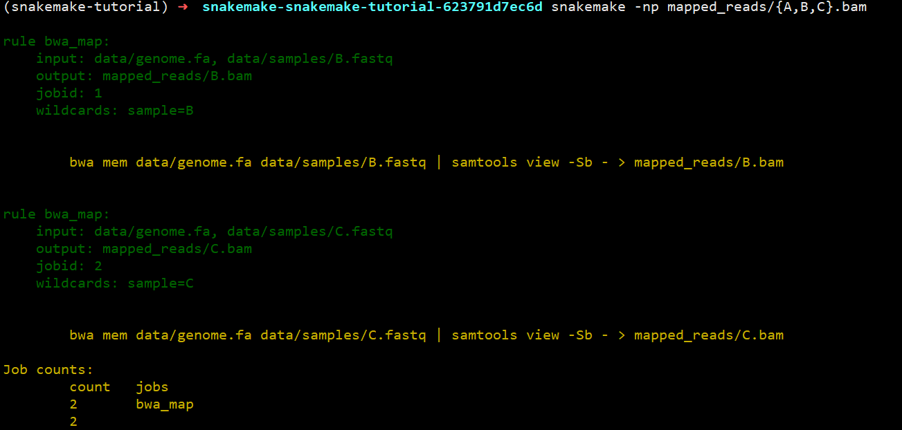
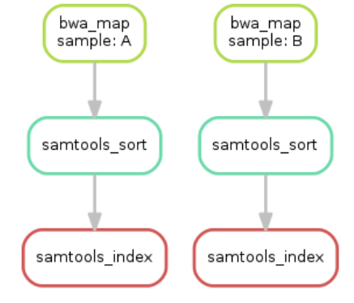

A review of bioinformatics pipeline framework 的作者对已有的工具进行很好的分类



作者的看法：

1.  implicit，也就是Make rule语法更适合用于整合不同执行工具
2.  基于配置的流程更加稳定，也比较适合用于集群分配任务。

最后作者建议是：

*   如果实验室既不是纯粹的生物学试验（不需要workbench这种UI界面），也不需要高性能基于类的流程设计， 不太好选， 主要原则是投入和产出比
*   如果实验室进行的是**重复性**的研究，那么就需要对数据和软件进行**版本控制**， 建议是 configuration-based pipelines
*   如果实验室做的是探索性的概念证明类工作（exploratory proofs-of-concept)，那么需要的是 DSL-based pipeline。
*   如果实验室用不到高性能计算机(HPC)，只能用云服务器，就是server-based frameworks.

目前已有的流程可以在[awesome-pipeline](https://github.com/pditommaso/awesome-pipeline) 进行查找。

就目前来看，pipeline frameworks & library 这部分的框架中 [nextflow](https://github.com/nextflow-io/nextflow) 是点赞数最多的生物学相关框架。只可惜nextflow在运行时需要创建fifo，而在NTFS文件系统上无法创建，所以我选择 _snakemake_ , 一个基于Python写的DSL流程框架。

环境准备
----

为了能够顺利完成这部分的教程，请准备一个Linux环境，如果使用Windows，则按照[biostarhandbook(一)分析环境和数据可重复](https://www.jianshu.com/p/f8cdb0e10940) 部署一个虚拟机，并安装miniconda3。

如下步骤会下载所需数据，并安装所需要的软件，并且启动工作环境。

```
wget https://bitbucket.org/snakemake/snakemake-tutorial/get/v3.11.0.tar.bz2
tar -xf v3.11.0.tar.bz2 --strip 1
cd snakemake-snakemake-tutorial-623791d7ec6d
conda env create --name snakemake-tutorial --file environment.yaml
source activate snakemake-tutorial
source deactivate
```

当前环境下的所有文件

```
├── data
│   ├── genome.fa
│   ├── genome.fa.amb
│   ├── genome.fa.ann
│   ├── genome.fa.bwt
│   ├── genome.fa.fai
│   ├── genome.fa.pac
│   ├── genome.fa.sa
│   └── samples
│       ├── A.fastq
│       ├── B.fastq
│       └── C.fastq
├── environment.yaml
└── README.md
```

基础：一个案例流程
---------

如果你编译过软件，那你应该见过和用过`make`, 但是你估计也没有仔细想过make是干嘛用的。Make是最常用的软件构建工具，诞生于1977年，主要用于C语言的项目，是为了处理编译时存在各种依赖关系，尤其是部分文件更新后，Make能够重新生成需要更新的文件以及其对应的文件。

`Snakemake`和Make功能一致，只不过用Python实现，增加了许多Python的特性，并且和Python一样非常容易阅读。下面将使用Snakemake写一个**变异检测**流程。

### 第一步：序列比对

Snakemake非常简单，就是写各种**rule**来完成不同的任务。我们第一条**rule**就是将序列比对到参考基因组上。如果在命令行下就是`bwa mem data/genome.fa data/samples/A.fastq | samtools view -Sb - > mapped_reads/A.bam`。 但是按照Snakemake的规则就是下面的写法。

```
# 用你擅长的文本编辑器
vim Snakefile
# 编辑如下内容
rule bwa_map:
    input:
        "data/genome.fa",
        "data/samples/A.fastq"
    output:
        "mapped_reads/A.bam"
    shell:
        """
        bwa mem {input} | samtools view -Sb - > {output}
        """
```

解释一下：这几行定义了一个规则(rule)，在这个规则下，输入(input)有两个，而输出(output)只有一个，在`shell`中运行命令，只不过里面的文件都用`{}`形式替代。伪执行一下:`snakemake -np mapped_reads/A.bam`检查一下是否会出错，真实运行情况如下（不带规则，默认执行第一个规则）:



### 第二步：推广序列比对规则

如果仅仅是上面这样子处理一个文件，还无法体现`snakemake`的用途，毕竟还不如手动敲代码来的方便。`snakemake`的一个有点在于它能够使用**文件名通配**的方式对一类文件进行处理。将上面的`A`改成`{sample}`,就可以将符合`*.fastq`的文件处理成`*.bam`.

```
rule bwa_map:
    input:
        "data/genome.fa",
        "data/samples/{sample}.fastq"
    output:
        "mapped_reads/{sample}.bam"
    shell:
        """
        bwa mem {input} | samtools view -Sb - > {output}
        """
```

那么，用`snakemake -np mapped_reads/{A,B,C}.bam`，就会发现，他非常机智的就比对了`B.fastq`和`C.fastq`，**而不会**再比对一遍A.fastq, **也不需要**你写一堆的判断语句去手动处理。



当然，如果你用`touch data/samples/A.fastq`改变A.fastq的时间戳，他就会认位A.fastq文件发生了改变，那么重复之前的命令就会比对A.fastq。

### 第三步：比对后排序

比对后的文件还需要进一步的排序，才能用于后续分析，那么规则该如何写呢？

```
rule samtools_sort:
    input:
        "mapped_reads/{sample}.bam"
    output:
        "sorted_reads/{sample}.bam"
    shell:
        "samtools sort -T sorted_reads/{wildcards.sample}"
        " -O bam {input} > {output}"
```

以之前的输出作为输出文件名，输出到另一个文件夹中。和之前的规则基本相同，只不过这里用到了`wildcards.sample`来获取通配名用作`-T`的临时文件的前缀`sample`实际名字。

运行`snakemake -np sorted_reads/B.bam`，你就会发现他就会非常智能的**先比对再排序**。这是因为`snakemake`会自动解决依赖关系，并且按照依赖的前后顺序进行执行。

### 第四步： 建立索引和对任务可视化

这里我们再写一个规则，对之前的排序后的BAM文件建立索引。

```
rule samtools_index:
    input:
        "sorted_reads/{sample}.bam"
    output:
        "sorted_reads/{sample}.bam.bai"
    shell:
        "samtools index {input}"
```

目前已经写了三个规则，那么这些规则的执行和依赖关系如何呢？ `snakemake`提供了`--dag`选项用于`dot`命令进行可视化

```
snakemake --dag sorted_reads/{A,B}.bam.bai | dot -Tsvg > dag.svg

```



### 第五步：基因组变异识别

基因组变异识别需要整合之前所有的BAM文件，你可能会打算这样写

```
rule bcftools_call:
    input:
        fa="data/genome.fa",
        bamA="sorted_reads/A.bam"
        bamB="sorted_reads/B.bam"
        baiA="sorted_reads/A.bam.bai"
        baiB="sorted_reads/B.bam.bai"
    output:
        "calls/all.vcf"
    shell:
        "samtools mpileup -g -f {input.fa} {input.bamA} {input.bamB} | "
        "bcftools call -mv - > {output}"

```

这样写的却没有问题，但是以后每多一个样本就需要多写一个输入，太麻烦了。这里就体现出Snakemake和Python所带来的特性了，我们可以用列表推导式的方法搞定。

```
["sorted_reads/{}.bam".format(sample) for sample in ["A","B"]]
```

进一步，可以在规则外定义`SAMPLES=["A","B"]`，则规则内的输入可以写成`bam=["sorted_reads/{}.bam".format(sample) for sample in SAMPLES]`. 由于列表推导式比较常用，但是写起来有点麻烦，snakemake定义了`expand`进行简化, 上面可以继续改写成`expand("sorted_reads/{sample}.bam", sample=SAMPLES)`

那么最后的规则就是

```
SAMPLES=["A","B"]
rule bcftools_call:
    input:
        fa="data/genome.fa",
        bam=expand("sorted_reads/{sample}.bam", sample=SAMPLES),
        bai=expand("sorted_reads/{sample}.bam.bai", sample=SAMPLES)
    output:
        "calls/all.vcf"
    shell:
        "samtools mpileup -g -f {input.fa} {input.bam} | "
        "bcftools call -mv - > {output}"

```

小练习： 请用snakemake生成当前的DAG图。

### 第六步：编写报告

上面都是在规则里执行shell脚本，snakemake的一个**优点**就是可以在规则里面写Python脚本，只需要把`shell`改成`run`，此外还不需要用到引号。

```
rule report:
    input:
        "calls/all.vcf"
    output:
        "report.html"
    run:
        from snakemake.utils import report
        with open(input[0]) as vcf:
            n_calls = sum(1 for l in vcf if not l.startswith("#"))

        report("""
        An example variant calling workflow
        ===================================

        Reads were mapped to the Yeast
        reference genome and variants were called jointly with
        SAMtools/BCFtools.

        This resulted in {n_calls} variants (see Table T1_).
        """, output[0], T1=input[0])
```

这里还用到了`snakemake`的一个函数，**report**，可以对markdown语法进行渲染生成网页。

### 第七步：增加**目标规则**

之前运行snakemake都是用的`snakemake 目标文件名`, 除了目标文件名外，snakemake还支持规则名作为目标。通常我们按照习惯定义一个`all`规则，来生成结果文件。

```
rule all:
    input:
        "report.html
```

### 基础部分小结：

总结下学习过程，知识点如下：

*   Snakemake基于规则执行命令，规则一般由`input, output,shell`三部分组成。
*   Snakemake可以自动确定不同规则的输入输出的依赖关系，根据时间戳来判断文件是否需要重新生成
*   Snakemake`以{sample}.fa`形式进行文件名通配，用`{wildcards.sample}`获取sample的实际文件名
*   Snakemake用`expand()`生成多个文件名，本质是Python的列表推导式
*   Snakemake可以在规则外直接写Python代码，在规则内的`run`里也可以写Python代码。
*   Snakefile的第一个规则通常是`rule all`，因为默snakemake默认执行第一条规则

进阶：对流程进一步修饰
-----------

在基础部分中，我们完成了流程的框架，下一步则是对这个框架进行不断完善，比如说编写配置文件，声明不同rule的消耗资源，记录运行日志等。

### 第一步： 声明所需进程数

对于一些工具，比如说bwa，多进程或者多线程运行能够大大加速计算。snakemake使用`threads`来定义当前规则所用的进程数，我们可以对之前的`bwa_map`增加该指令。

```
rule bwa_map:
    input:
        "data/genome.fa",
        "data/samples/{sample}.fastq"
    output:
        "mapped_reads/{sample}.bam"
    threads:8
    shell:
        "bwa mem -t {threads} {input} | samtools view -Sb - > {output}"
```

声明`threads`后，Snakemake任务调度器就会在程序运行的时候是否**并行**多个任务。这主要和参数中的`--cores`相关。比如说

```
snakemake --cores 10
```

由于总体上就分配了10个核心，于是一次就只能运行一个需要消耗8个核心的`bwa_map`。但是当其中一个`bwa_map`运行完毕，这个时候snakemaek就会同时运行一个消耗8个核心的`bwa_map`和没有设置核心数的`samtools_sort`,来保证效率最大化。因此对于需要多线程或多进程运行的程序而言，将所需的进程**单独编码**，而不是硬编码到shell命令中，能够更有效的使用资源。

### 第二步：配置文件

之前的SAMPLES写在了snakefile，也就是意味这对于不同的项目，需要对snakefile进行修改，更好的方式是用一个配置文件。配置文件可以用JSON或YAML语法进行写，然后用`configfile: "config.yaml"`读取成字典，变量名为config。

`config.yaml`内容为:

```
samples:
    A: data/samples/A.fastq
    B: data/samples/B.fastq
```

> YAML使用缩进表示层级关系，其中缩进必须用空格，但是空格数目不重要，重要的是所今后左侧对齐。上面的YAML被Pytho读取之后，以字典保存，形式为`{'samples': {'A': 'data/samples/A.fastq', 'B': 'data/samples/B.fastq'}}`

而snakefile也可以改写成

```
configfile: "config.yaml"
...
rule bcftools_call:
    input:
        fa="data/genome.fa",
        bam=expand("sorted_reads/{sample}.bam", sample=config["samples"]),
        bai=expand("sorted_reads/{sample}.bam.bai", sample=config["smaples])
    output:
        "calls/all.vcf"
    shell:
        "samtools mpileup -g -f {input.fa} {input.bam} | "
        "bcftools call -mv - > {output}"
```

虽然sample是一个字典，但是展开的时候，只会使用他们的key值部分。

关于YAML格式的教程，见阮一峰的博客：[http://www.ruanyifeng.com/blog/2016/07/yaml.html](http://www.ruanyifeng.com/blog/2016/07/yaml.html)

### 第三步：输入函数

既然已经把文件路径都存入到配置文件中，那么可以进一步的改写之前的`bwa_map`里的输入部分。也就是从字典里面提取到存放的路径。最开始我就是打算这样写

```
rule bwa_map:
    input:
        "data/genome.fa",
        config['samples']["{sample}"]
    output:
        "mapped_reads/{sample}.bam"
    threads:8
    shell:
        "bwa mem -t {threads} {input} | samtools view -Sb - > {output}"
```

毕竟"{sample}"从理论上应该得到sample的名字。但是`snakemake -np`显示出现错误

```
KeyError in line 11 of /home6/zgxu/snakemake-snakemake-tutorial-623791d7ec6d/Snakefile:
'{sample}'
```

这可能是`{sample}`的形式只能在匹配的时候使用，而在获取值的时候应该用基础第三步的`wildcards.sample`形式。于是继续改成`config["samples"][wildcards.sample]`。然而还是出现了错误。

```
name 'wildcards' is not defined
```

为了理解错误的原因，并找到解决方法，我们需要理解Snakemake工作流程执行的一些原理，它执行分为三个阶段

*   在**初始化**阶段，工作流程会被解析，所有规则都会被实例化
*   在**DAG**阶段，也就是生成有向无环图，确定依赖关系的时候，所有的通配名部分都会被真正的文件名代替。
*   在**调度**阶段，DAG的任务按照顺序执行

也就是说在**初始化**阶段，我们是无法获知通配符所指代的具体文件名，必须要等到第二阶段，才会有`wildcards`变量出现。也就是说之前的出错的原因都是因为第一个阶段没通过。这个时候就需要**输入函数**推迟文件名的确定，可以用Python的匿名函数，也可以是普通的函数

```
rule bwa_map:
    input:
        "data/genome.fa",
        lambda wildcards: config["samples"][wildcards.sample]
    output:
        "mapped_reads/{sample}.bam"
    threads: 8
    shell:
        "bwa mem -t {threads} {input} | samtools view -Sb - > {output}"
```

### 第四步：规则参数

有些时候，shell命令不仅仅是由input和output中的文件组成，还需要一些静态的参数设置。如果把这些参数放在input里，则会因为找不到文件而出错，所以需要专门的`params`用来设置这些参数。

```
rule bwa_map:
    input:
        "data/genome.fa",
        lambda wildcards: config["samples"][wildcards.sample]
    output:
        "mapped_reads/{sample}.bam"
    threads: 8
    params:
        rg="@RG\tID:{sample}\tSM:{sample}"
    shell:
        "bwa mem -R '{params.rg}' '-t {threads} {input} | samtools view -Sb - > {output}"
```

写在rule中的params的参数，可以在shell命令中或者是run里面的代码进行调用。

### 第五步： 日志文件

当工作流程特别的大，每一步的输出日志都建议保存下来，而不是输出到屏幕，这样子出错的时候才能找到出错的所在。`snakemake`非常贴心的定义了`log`,用于记录日志。好处就在于出错的时候，在`log`里面定义的文件是不会被snakemake删掉，而output里面的文件则是会被删除。继续修改之前的`bwa_map`.

```
rule bwa_map:
    input:
        "data/genome.fa",
        lambda wildcards: config["samples"][wildcards.sample]
    output:
        "mapped_reads/{sample}.bam"
    params:
        rg="@RG\tID:{sample}\tSM:{sample}"
    log:
        "logs/bwa_mem/{sample}.log"
    threads: 8
    shell:
        "(bwa mem -R '{params.rg}' -t {threads} {input} | "
        "samtools view -Sb - > {output}) 2> {log}"
```

这里将标准错误重定向到了log中。

### 第六步：临时文件和受保护的文件

由于高通量测序的数据量通常很大，因此很多无用的中间文件会占据大量的磁盘空间。而特异在执行结束后写一个shell命令清除不但写起来麻烦，而且也不好管理。Snakemake使用`temp()`来将一些文件标记成临时文件，在执行结束后自动删除。

```
rule bwa_map:
    input:
        "data/genome.fa",
        lambda wildcards: config["samples"][wildcards.sample]
    output:
        temp("mapped_reads/{sample}.bam")
    params:
        rg="@RG\tID:{sample}\tSM:{sample}"
    log:
        "logs/bwa_mem/{sample}.log"
    threads: 8
    shell:
        "(bwa mem -R '{params.rg}' -t {threads} {input} | "
        "samtools view -Sb - > {output}) 2> {log}"
```

修改之后的代码，当`samtools_sort`运行结束后就会把"mapped\_reads"下的BAM删掉。同时由于比对和排序都比较耗时，得到的结果要是不小心被误删就会浪费大量计算时间，最后的方法就是用`protected()`保护起来

```
rule samtools_sort:
    input:
        "mapped_reads/{sample}.bam"
    output:
        protected("sorted_reads/{sample}.bam")
    shell:
        "samtools sort -T sorted_reads/{wildcards.sample} "
        "-O bam {input} > {output}"
```

最后，snakemake就会在文件系统中对该输出文件写保护，也就是最后的权限为`-r--r--r--`, 在删除的时候会问你`rm: remove write-protected regular file ‘A.bam’?`.

### 进阶部分小结

*   使用`threads:`定义不同规则所需线程数，有利于snakemake全局分配任务，最优化任务并行
*   使用`configfile:`读取配置文件，将配置和流程分离
*   snakemake在**DAG**阶段才会知道通配的具体文件名，因此在input和output出现的`wildcards`就需要推迟到第二步。
*   在`log`里定义的日志文件，不会因任务失败而被删除
*   在`params`定义的参数，可以在shell和run中直接调用
*   `temp()`中的文件运行结束后会被删除，而`protected()`中的文件会有写保护，避免意外删除。

高级：实现流程的自动部署
------------

上面的分析流程都是基于当前环境下已经安装好要调用的软件，如果你希望在新的环境中也能快速部署你的分析流程，那么你需要用到snakmake更高级的特性，也就是为每个rule定义专门的运行环境。

### 全局环境

我建议你在新建一个snakemake项目时，都先用`conda create -n 项目名 python=版本号`创建一个全局环境，用于安装一些常用的软件，例如bwa、samtools、seqkit等。然后用如下命令将环境导出成yaml文件

```
conda env export -n 项目名 -f environment.yaml
```

那么当你到了一个新的环境，你就可以用下面这个命令重建出你的运行环境

```
conda env create -f environment.yaml
```

### 局部环境

当然仅仅依赖于全局环境或许还不够，对于不同的规则(rule)可能还有Python2和Python3的区别，所以你还得为每个规则创建环境。

snakemake有一个参数`--use-conda`,会解析`rule`中的`conda`规则，根据其提供的yaml文件安装特定版本的工具，以基础第一步的序列比对为例，

```
rule bwa_map:
    input:
        "data/genome.fa",
        "data/samples/A.fastq"
    output:
        "mapped_reads/A.bam"
    conda:
        "envs/map.yaml"
    shell:
        """
        mkdir -p mapped_reads
        bwa mem {input} | samtools view -Sb - > {output}
        """
```

随后在snakemake执行的目录下创建envs文件夹，增加map.yaml, 内容如下

```
name: map
channels:
  - https://mirrors.tuna.tsinghua.edu.cn/anaconda/cloud/bioconda/
  - https://mirrors.tuna.tsinghua.edu.cn/anaconda/cloud/conda-forge/
  - https://mirrors.tuna.tsinghua.edu.cn/anaconda/pkgs/main/
  - https://mirrors.tuna.tsinghua.edu.cn/anaconda/pkgs/free/
  - defaults
dependencies:
  - bwa=0.7.17
  - samtools=1.9
show_channel_urls: true
```

**注意**: YAML文件的`name`行不是必要的，但是建议加上。

那么当你用`snakmake --use-conda`执行时，他就会在`.snakemake/conda`下创建专门的conda环境用于处理当前规则。对于当前项目，该conda环境创建之后就会一直用于该规则，除非yaml文件发生改变。

如果你希望在实际运行项目之前先创建好环境，那么可以使用`--create-envs-only`参数。

由于默认情况下，每个项目运行时只会在当前的`.snakemake/conda`查找环境或者安装环境，所以在其他目录执行项目时，snakemake又会重新创建conda环境，如果你担心太占地方或者环境太大，安装的时候太废时间，你可以用`--conda-prefix`指定专门的文件夹。

代码总结
----

最后的代码如下

```
configfile: "config.yaml"


rule all:
    input:
        "report.html"


rule bwa_map:
    input:
        "data/genome.fa",
        lambda wildcards: config["samples"][wildcards.sample]
    output:
        temp("mapped_reads/{sample}.bam")
    params:
        rg="@RG\tID:{sample}\tSM:{sample}"
    log:
        "logs/bwa_mem/{sample}.log"
    threads: 8
    shell:
        "(bwa mem -R '{params.rg}' -t {threads} {input} | "
        "samtools view -Sb - > {output}) 2> {log}"


rule samtools_sort:
    input:
        "mapped_reads/{sample}.bam"
    output:
        protected("sorted_reads/{sample}.bam")
    shell:
        "samtools sort -T sorted_reads/{wildcards.sample} "
        "-O bam {input} > {output}"


rule samtools_index:
    input:
        "sorted_reads/{sample}.bam"
    output:
        "sorted_reads/{sample}.bam.bai"
    shell:
        "samtools index {input}"


rule bcftools_call:
    input:
        fa="data/genome.fa",
        bam=expand("sorted_reads/{sample}.bam", sample=config["samples"]),
        bai=expand("sorted_reads/{sample}.bam.bai", sample=config["samples"])
    output:
        "calls/all.vcf"
    shell:
        "samtools mpileup -g -f {input.fa} {input.bam} | "
        "bcftools call -mv - > {output}"


rule report:
    input:
        "calls/all.vcf"
    output:
        "report.html"
    run:
        from snakemake.utils import report
        with open(input[0]) as vcf:
            n_calls = sum(1 for l in vcf if not l.startswith("#"))

        report("""
        An example variant calling workflow
        ===================================

        Reads were mapped to the Yeast
        reference genome and variants were called jointly with
        SAMtools/BCFtools.

        This resulted in {n_calls} variants (see Table T1_).
        """, output[0], T1=input[0])
```

执行snakemake
-----------

写完Snakefile之后就需要用`snakemake`执行。`snakemake`的选项非常多，这里列出一些比较常用的运行方式。

运行前检查潜在错误：

```
snakemake -n
snakemake -np
snakemake -nr
```

直接运行:

```
snakemake
snakemake -s Snakefile -j 4
```

强制重新运行：

```
snakemake -f
snakemake -F
snakemake -R some_rule
```

可视化：

```
snakemake --dag  | dot -Tsvg > dag.svg
snakemake --dag  | dit -Tpdf > dag.pdf
snakemake --gui 0.0.0.0:2468
```

集群执行：

```
snakemake --cluster "qsub -V -cwd -q 投递队列" -j 10
```

参考资料
----

*   [snakemake官方文档](http://snakemake.readthedocs.io/en/latest/)
*   [用snakemake写RNA-Seq流程](http://pedagogix-tagc.univ-mrs.fr/courses/ABD/practical/snakemake/snake_intro.html)
*   [阮一峰的YAML教程](http://www.ruanyifeng.com/blog/2016/07/yaml.html)
*   [阮一峰的Make命令教程](http://www.ruanyifeng.com/blog/2015/02/make.html)
*   [conda管理环境](https://conda.io/docs/user-guide/tasks/manage-environments.html)