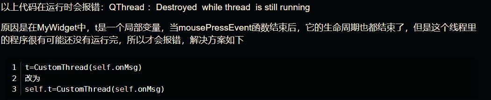

# PyQt语法总结

## 表格

### QTableWidget

```python
# 创建表格控件
self.tableWidge = QTableWidget()
# 获取df行列数,并设置到表格
row,col = self.df.shape
self.tableWidge.setRowCount(row)
self.tableWidge.setColumnCount(col)
#列名设置
self.tableWidge.setHorizontalHeaderLabels(self.df.columns.tolist())
# 数字或者字符串,使用QTableWidgetItem
# 前两列为文件名和样本名
for i in range(row):
	for j in range(2):
		self.tableWidge.setItem(i,j,QTableWidgetItem(self.df.iloc[i,j]))

# 日期格式需要转换到QDate
for i in range(row):
	for j in range(2,5):
		date = self.df.iloc[i,j]
        # 注意这里的year,month,day都没有方法
		qdate = QDate(date.year,date.month,date.day)
		datedit = QDateEdit(qdate)
		datedit.setDisplayFormat('yyyy-MM-dd')
		datedit.setCalendarPopup(True)
		self.tableWidge.setCellWidget(i,j,datedit)
```

**QThread ：Destroyed while thread is still running**

