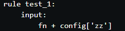

**V3 使用配置文件,使用ST型分组**

```python
import pandas as pd
import datetime
import os

configfile: "config/nosott.yaml"


def generate_csv(casedata, dirname):
    dates = ['Admdate', 'Sampdate', 'Chgdate']
    baseDate = min(casedata['Sampdate'])

    for ind, row in casedata.iterrows():
        bDate = datetime.datetime.strptime(baseDate, "%Y-%m-%d")
        Adate, Sdate, Cdate = [datetime.datetime.strptime(row[i], "%Y-%m-%d") for i in dates]
        casedata['Admdate'][ind], casedata['Sampdate'][ind], casedata['Chgdate'][ind] = \
            (Adate - bDate).days, (Sdate - bDate).days, (Cdate - bDate).days

    dates = pd.DataFrame({'A': casedata['name'], 'B': casedata['Sampdate']})
    hosts = pd.DataFrame({'A': casedata['name'], 'B': casedata['item']})
    hostTimes = pd.DataFrame({'A': casedata['item'], 'B': casedata['Admdate'], 'C': casedata['Chgdate']})

    try:
        dates.to_csv('output/datefile/{}.dates.csv'.format(dirname), index=False, header=False)
        hosts.to_csv('output/datefile/{}.hosts.csv'.format(dirname), index=False, header=False)
        hostTimes.to_csv('output/datefile/{}.hostTimes.csv'.format(dirname), index=False, header=False)
    except IOError as e:
        print("Save datefile failed!:%s", e)

    print("Generate date file success")


# 写入规则
rule all:
    input:
        expand("output/{sample}_direct_transmissions.jpg", sample=config.keys()),
        expand("output/{sample}_indirect_transmissions.jpg", sample=config.keys())

rule copy_to_temp:
    input:
        lambda wildcards: expand("{file}", file=config[(wildcards.sample)][1:])
    output:
        temp('output/fasta/{sample}')
    shell:
        "mkdir -p {output};"
        "rm -f {output}/* ;"
        "cp {input} {output}"

rule parsnp_align:
    input:
        fas = "output/fasta/{sample}",
        ref = lambda wildcards: config[(wildcards.sample)][0]
    output:
        temp("output/parsnp/{sample}"),
        temp("output/parsnp/{sample}.xmfa")
    shell:
        "parsnp -r {input.ref} -o output/parsnp/{wildcards.sample} -d {input.fas} -c -x 1>/dev/null;"
        "mv output/parsnp/{wildcards.sample}/parsnp.xmfa output/parsnp/{wildcards.sample}.xmfa"

rule harvesttools_transform:
    input:
        "output/parsnp/{sample}.xmfa"
    output:
        temp("output/parsnp/{sample}.fasta")
    shell:
        "harvesttools -x {input} -M {output};"
        "sed -i 's/.ref//g' {output};"
        "sed -i 's/.fasta//g' {output}"

rule generate_datefile:
    input:
        "data/casedate/casedatabase.csv"
    output:
        d = temp('output/datefile/{sample}.dates.csv'),
        ho = temp('output/datefile/{sample}.hosts.csv'),
        ht = temp('output/datefile/{sample}.hostTimes.csv'),
    run:
        # x = (wildcards.sample).split('.')[1].split('_')
        x = [os.path.basename(i)[:-6] for i in config[(wildcards.sample)]]
        df = pd.read_csv('data/casedate/casedatabase.csv')
        df = df[df['name'].isin(x)]
        generate_csv(df, wildcards.sample)

rule generate_xml:
    input:
        scotti_xml = 'scripts/SCOTTI_generate_xml.py',
        fasta = "output/parsnp/{sample}.fasta",
        d = 'output/datefile/{sample}.dates.csv',
        ho = 'output/datefile/{sample}.hosts.csv',
        ht = 'output/datefile/{sample}.hostTimes.csv'
    output:
        temp("output/parsnp/{sample}.xml")
    params:
        m = lambda wildcards: len(config[(wildcards.sample)]) + 2,
        n = 100000
    shell:
        "python {input.scotti_xml} "
        "-d {input.d} -ho {input.ho} -ht {input.ht} "
        "-m {params.m} -n {params.n} "
        "-o output/parsnp/{wildcards.sample} -f {input.fasta}"

rule generate_tree:
    input:
        xml = "output/parsnp/{sample}.xml",
        scotti_jar = "scripts/SCOTTI.v2.0.1.jar",
        jblas_jar = "scripts/jblas-1.2.3.jar",
        guava_jar = "scripts/guava-15.0.jar",
        beast_jar = "scripts/beast.jar"
    output:
        temp("output/parsnp/{sample}.trees"),
        temp("output/parsnp/{sample}.log"),
        temp("{sample}.xml.state")
    params:
        "beast.app.beastapp.BeastMain -overwrite"
    shell:
        "java -cp "
        "{input.scotti_jar}:{input.jblas_jar}:{input.guava_jar}:{input.beast_jar} "
        "{params} {input.xml} 1>/dev/null"

rule generate_jpg:
    input:
        tree = "output/parsnp/{sample}.trees",
        trans_tree = "scripts/Make_transmission_tree_alternative.py"
    output:
        "output/{sample}_direct_transmissions.jpg",
        "output/{sample}_indirect_transmissions.jpg"
    params:
        minV = 0.2
    shell:
        "python {input.trans_tree} --input {input.tree}  "
        "--outputF output/{wildcards.sample} "
        "--minValue {params.minV} "
```

**V2 加入ST型检测**

增加ST型判断,自动分组,运行得到对应结果.

```python
import os
import pandas as pd
import datetime
import sys

samples = ['3','6','9','12','4']

def quit_with_error(message):
    """Displays the given message and ends the program's execution."""
    print('Error:', message, file=sys.stderr)
    sys.exit(1)

def generate_csv(casedata,dirname):
    dates = ['Admdate','Sampdate','Chgdate']
    baseDate = min(casedata['Sampdate'])

    for ind,row in casedata.iterrows():
        bDate = datetime.datetime.strptime(baseDate,"%Y-%m-%d")
        Adate,Sdate,Cdate = [datetime.datetime.strptime(row[i],"%Y-%m-%d") for i in dates]
        casedata['Admdate'][ind], casedata['Sampdate'][ind],casedata['Chgdate'][ind] = \
            (Adate - bDate).days,(Sdate - bDate).days, (Cdate - bDate).days

    dates = pd.DataFrame({'A':casedata['name'],'B':casedata['Sampdate']})
    hosts = pd.DataFrame({'A':casedata['name'],'B':casedata['item']})
    hostTimes = pd.DataFrame({'A':casedata['item'],'B':casedata['Admdate'],'C':casedata['Chgdate']})

    try:
        dates.to_csv('output/datefile/{}.dates.csv'.format(dirname),index=False,header=False)
        hosts.to_csv('output/datefile/{}.hosts.csv'.format(dirname),index=False,header=False)
        hostTimes.to_csv('output/datefile/{}.hostTimes.csv'.format(dirname),index=False,header=False)
    except IOError as e:
        print("Save datefile failed!:%s", e)
    
    print("Generate date file success")

def get_samples(names,casedate,items):
    if os.path.exists('data/mlst_database/STs.txt'):
        df = pd.read_csv('data/mlst_database/STs.txt',sep='\t', \
                          names=['name','species','ST']+["gene"+str(i) for i in range(7)])
        fastas = [i for i in names if i not in list(df['name'])]
    if len(fastas) > 0:
        os.system('mlst {} >> data/mlst_database/STs.txt'.format(' '.join(fastas)))  
    df = pd.read_csv('data/mlst_database/STs.txt',sep='\t',\
                      names=['name','species','ST']+["gene"+str(i) for i in range(7)])
    df_temp = pd.DataFrame()
    df_temp['item'] = items
    df_temp['name'] = names
    df = pd.merge(df_temp,df,how='left',on = 'name')
    df['spe_st'] = df['species'].str.cat(df['ST'].apply(str),sep="_ST")
    df_merge = df.groupby(by = 'spe_st').apply(lambda x: '_'.join(x['item']) )
    df_merge2 = df.groupby(by = 'spe_st').apply(lambda x: '_'.join(x['name']) )
    index  = df_merge.index   
    name = [(k1,k2) for k1,k2 in zip(df_merge,df_merge2) if len(k1.split('_')) > 1]
    x = {'.'.join([i,j]):k.split('_') for i,(j,k) in zip(index,name)}
    return x


# 数据筛选
df = pd.read_csv('data/casedate/casedatabase.csv',\ 
                  names=['item','name','Admdate','Sampdate','Chgdate'])
df = df[df['item'].isin(samples)]
fastas = ['data/fasta'+"/"+i+".fasta" for i in df['name']]

x = [i for i in samples if i not in list(df['item'])]
if len(x) != 0:
    quit_with_error("sample {} has no clinical data".format(",".join(x)))

y = [os.path.basename(i) for i in fastas if not os.path.exists(i)]
if len(y) != 0:
    quit_with_error("sample {} has no fasta file".format(",".join(y)))

samples_items = get_samples(fastas,'data/casedate/casedatabase.csv',list(df['item']))


# 写入规则
rule all:
    input:
        expand("output/{sample}_direct_transmissions.jpg",sample =samples_items.keys()),
        expand("output/{sample}_indirect_transmissions.jpg",sample =samples_items.keys())

rule copy_to_temp:
    input:
        lambda wildcards:  expand("{file}",file = samples_items[(wildcards.sample)][1:])
    output:
        temp('output/fasta/{sample}')
    shell:
        "mkdir -p {output};"
        "rm -f {output}/* ;"
        "cp {input} {output}"

rule parsnp_align:
    input:
        fas = "output/fasta/{sample}",
        ref = lambda wildcards: samples_items[(wildcards.sample)][0]
    output:
        temp("output/parsnp/{sample}"),
        temp("output/parsnp/{sample}.xmfa")
    shell:
        "parsnp -r {input.ref} -o output/parsnp/{wildcards.sample} -d {input.fas} -c -x 1>/dev/null;"
        "mv output/parsnp/{wildcards.sample}/parsnp.xmfa output/parsnp/{wildcards.sample}.xmfa"
rule harvesttools_transform:
    input:
        "output/parsnp/{sample}.xmfa"
    output:
        temp("output/parsnp/{sample}.fasta")
    shell:
        "harvesttools -x {input} -M {output};"
        "sed -i 's/.ref//g' {output};"
        "sed -i 's/.fasta//g' {output}"

rule generate_datefile:
    input:
        "data/casedate/casedatabase.csv"
    output:
        d = temp('output/datefile/{sample}.dates.csv'),
        ho = temp('output/datefile/{sample}.hosts.csv'),
        ht = temp('output/datefile/{sample}.hostTimes.csv'),
    run:
        x = (wildcards.sample).split('.')[1].split('_')
        df = pd.read_csv('data/casedate/casedatabase.csv',\ 
                          names=['item','name','Admdate','Sampdate','Chgdate'])
        df = df[df['item'].isin(x)]
        generate_csv(df,wildcards.sample)

rule generate_xml:
    input:
        scotti_xml = 'scripts/SCOTTI_generate_xml.py',
        fasta = "output/parsnp/{sample}.fasta",
        d = 'output/datefile/{sample}.dates.csv',
        ho = 'output/datefile/{sample}.hosts.csv',
        ht = 'output/datefile/{sample}.hostTimes.csv'
    output:
        temp("output/parsnp/{sample}.xml")
    params:
        m = lambda wildcards:  len(samples_items[(wildcards.sample)]) + 2,
        n = 100000
    shell:
        "python {input.scotti_xml} "
        "-d {input.d} -ho {input.ho} -ht {input.ht} "
        "-m {params.m} -n {params.n} "
        "-o output/parsnp/{wildcards.sample} -f {input.fasta}"

rule generate_tree:
    input:
        xml = "output/parsnp/{sample}.xml",
        scotti_jar = "scripts/SCOTTI.v2.0.1.jar",
        jblas_jar = "scripts/jblas-1.2.3.jar",
        guava_jar = "scripts/guava-15.0.jar",
        beast_jar = "scripts/beast.jar"
    output:
        temp("output/parsnp/{sample}.trees"),
        temp("output/parsnp/{sample}.log"),
        temp("{sample}.xml.state")
    params:
        "beast.app.beastapp.BeastMain -overwrite"
    shell:
        "java -cp "
        "{input.scotti_jar}:{input.jblas_jar}:{input.guava_jar}:{input.beast_jar} "
        "{params} {input.xml} 1>/dev/null"

rule generate_jpg:
    input:
        tree = "output/parsnp/{sample}.trees",
        trans_tree = "scripts/Make_transmission_tree_alternative.py"
    output:
        "output/{sample}_direct_transmissions.jpg",
        "output/{sample}_indirect_transmissions.jpg"
    params:
        minV = 0.2
    shell:
        "python {input.trans_tree} --input {input.tree}  "
        "--outputF output/{wildcards.sample} "
        "--minValue {params.minV} "

```


**V1 NosoTT流程**

```bash
# snakemake运行传递参数,注意可以直接调用
snakemake --config zz="filename" -s NosoTT.rules
```

 

```python
import os
import shutil
import pandas as pd
import datetime

samples = ['3','6','9']

casedate = r'/home/dengqiuyang/Transmission_DataFile/casedate/casedatabase.csv'
fasta_dir = r'/home/dengqiuyang/Transmission_DataFile/fasta'
basedir =  r'/home/dengqiuyang/Transmission_DataFile/'
temp_dir = r'/home/dengqiuyang/fasta_temp'

if not os.path.exists(temp_dir):
    os.mkdir(temp_dir)

def copy_file(path,fastas):
    ls = os.listdir(path)
    for i in ls:
        c_path = os.path.join(path, i)
        if os.path.isdir(c_path):
            del_file(c_path)
        else:
            os.remove(c_path)
    [shutil.copy(i,path) for i in fastas[1:]]

def generate_csv(casedata):
    dates = ['Admdate','Sampdate','Chgdate']

    # casedata = pd.read_csv(casedate,names=['item','name','Admdate','Sampdate','Chgdate'])
    baseDate = min(casedata['Sampdate'])

    for ind,row in casedata.iterrows():
        bDate = datetime.datetime.strptime(baseDate,"%Y-%m-%d")
        Adate,Sdate,Cdate = [datetime.datetime.strptime(row[i],"%Y-%m-%d") for i in dates]
        casedata['Admdate'][ind], casedata['Sampdate'][ind],casedata['Chgdate'][ind] = \
            (Adate - bDate).days,(Sdate - bDate).days, (Cdate - bDate).days

    dates = pd.DataFrame({'A':casedata['name'],'B':casedata['Sampdate']})
    hosts = pd.DataFrame({'A':casedata['name'],'B':casedata['item']})
    hostTimes = pd.DataFrame({'A':casedata['item'],'B':casedata['Admdate'],'C':casedata['Chgdate']})

    try:
        dates.to_csv('{}dates.csv'.format(basedir),index=False,header=False)
        hosts.to_csv('{}hosts.csv'.format(basedir),index=False,header=False)
        hostTimes.to_csv('{}hostTimes.csv'.format(basedir),index=False,header=False)
    except IOError as e:
        print("Save datefile failed!:%s", e)
    
    print("Generate date file success")

# 数据筛选
df = pd.read_csv(casedate,names=['item','name','Admdate','Sampdate','Chgdate'])
df = df[df['item'].isin(samples)]
fastas = [fasta_dir+"/"+i+".fasta" for i in df['name']]

# 准备对应数据
copy_file(temp_dir,fastas)
generate_csv(df)
ref = fastas[0]

# 相关命令
generateXml = "python {}SCOTTI_generate_xml.py  -o scotti -d {}dates.csv -ho {}hosts.csv -ht {}hostTimes.csv -ov -m {} -n 100000 -f ".format(basedir,basedir,basedir,basedir,len(samples) + 2)

generateTree = "java -cp {}SCOTTI.v2.0.1.jar:{}jblas-1.2.3.jar:{}guava-15.0.jar:{}beast.jar beast.app.beastapp.BeastMain -overwrite ".format(basedir,basedir,basedir,basedir)

generateJpg = "python {}Make_transmission_tree_alternative.py".format(basedir)


# 写入规则   
rule all:
    input:
        "disease_direct_transmissions.jpg",
        "disease_indirect_transmissions.jpg"

rule parsnp_align:
    output:
        "parsnp/parsnp.xmfa"
    shell:
        "parsnp -r {ref} -o parsnp -d {temp_dir} -c -x 1>/dev/null"

rule harvesttools_transform:
    input:
        "parsnp/parsnp.xmfa"
    output:
        "parsnp/parsnp.fasta"
    shell:
        "harvesttools -x {input} -M {output};"
        "sed -i 's/.ref//g' parsnp/parsnp.fasta;"
        "sed -i 's/.fasta//g' parsnp/parsnp.fasta"

rule generate_xml:
    input:
        "parsnp/parsnp.fasta"
    output:
        temp("parsnp"),
        temp("scotti.xml")
    shell:
        "{generateXml} parsnp/parsnp.fasta"

rule generate_tree:
    input:
        "scotti.xml"
    output:
        temp("scotti.trees"),
        temp("scotti.log"),
        temp("scotti.xml.state")
    shell:
        "{generateTree} {input}"

rule generate_jpg:
    input:
        "scotti.trees"
    output:
        "disease_direct_transmissions.jpg",
        "disease_indirect_transmissions.jpg"
    shell:
        "{generateJpg} --input {input}  --outputF disease --minValue 0.2"

```

