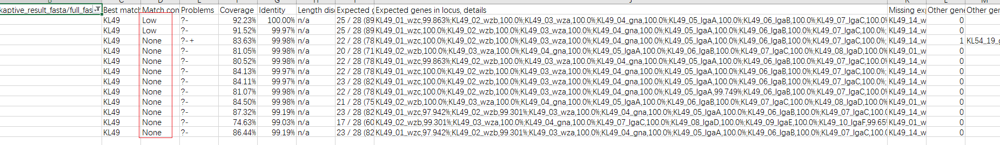
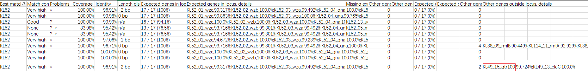
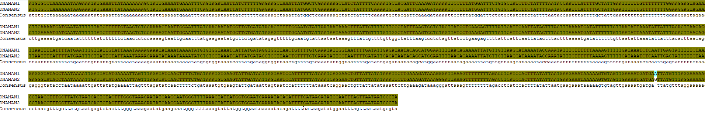

> lyb24序列是KL49型上面的一段序列,现在的思路是证明hvct的特异性.

---

### 鉴定ncbi上所有鲍曼的KL49型菌株

下载3341株鲍曼,使用kaptive软件,鉴定到95株KL49

## blast比对hvct序列

从3341株中比对hvct,找到84株,其中83株是KL49.

1. 剩下12株没有鉴定到hvct,对这些求合集,发现它们都没有KL49上的"wzy","gtr100"和"wzx"三个基因.
2. 除了KL49,还有一株KL52鉴定到hvct,而这株的kaptive结果说明里发现还额外鉴定到gtr100基因.
3. 使用hvct和gtr100的序列比对发现,它们是一致的.

综上,我们发现的hvct就是KL49型的gtr100基因,它在鲍曼菌株中是特殊存在的.

↑没有鉴定到hvct的12株,比对质量值较低

↑鉴定到KL52的那株有gtr100基因

↑hvct和gtr100的序列比对

## 特异性判断

鉴于gtr100是KL型中唯一存在的基因,统计所有KL型中唯一的基因,一共找到了117个基因.

gtr(87种): glycosyltransferase 糖基转移酶

atr(12种): acetyltransferase 乙酰转移酶

Ptr(3种): pyruvyltransferase 丙酮基转移酶

gne(2种): UDP-glucose/UDP-N-acetyl-glucosamine

DmaA: 2-epimerase  差向异构酶

aciE: oxidoreductase/dehydratase; involved in thesynthesis of 8-epi-acinetaminic acid  氧化还原酶/脱水酶

fdtA: dTDP-4-keto-6-deoxy-D-glucose 3,4-ketoisomerase 酮异构酶

fdtC: acetyltransferase 乙酰转移酶

glf: UDP-galactopyranose mutase 半乳糖突变酶

manC: predicted mannose-1-phosphate guanyltransferase 鸟苷转移酶

neuA: cytidylyltransferase required for CMP-N-acetylneuraminic acid 胞嘧啶转移酶

neuB: synthase required for CMP-N- acetylneuraminic acid CMP-N-乙酰神经氨酸所需的合酶

qdtA: dTDP-6-deoxy-3,4-keto-hexulose isomerase 异构酶

qdtB: aminotransferase 氨基转移酶

qdtC:acetyltransferase 乙酰转移酶

qdtE: hypothetical protein

ugd3:Ugd3 nucleotide-sugar dehydrogenase 核糖脱氢酶