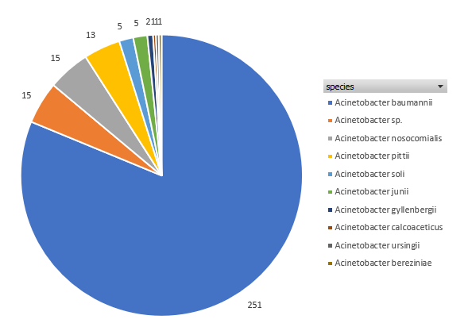
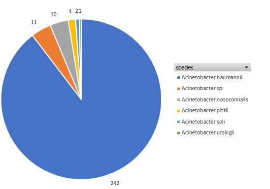
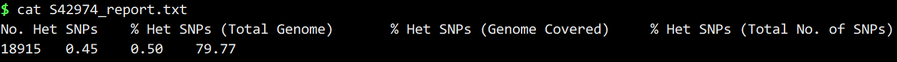
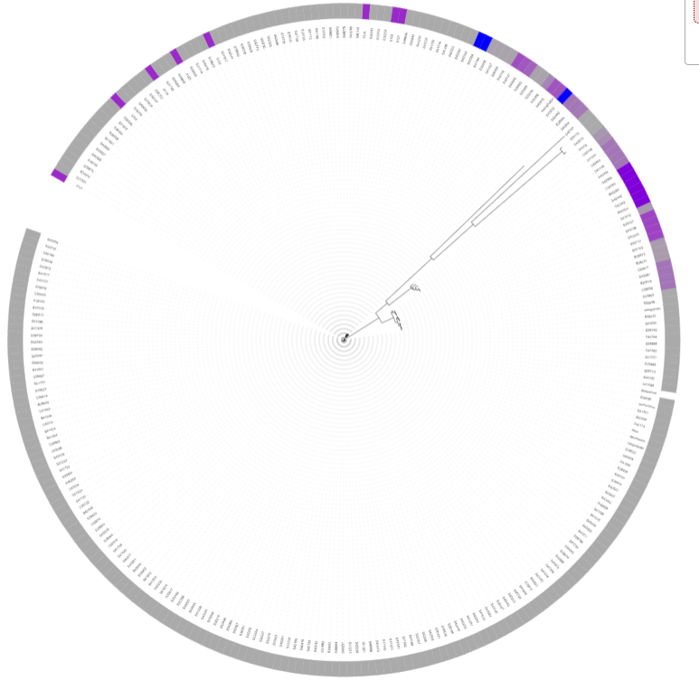

## 1.质控标准

### 组装质量

#### 过滤低质量碱基

1. 两端修剪质量值小于4的剪辑;
2. 滑窗去掉质量平均值小于15的片段;
3. 丢弃过滤后长度小于36的reads.

#### De novo组装

1. k-mer选择41,49,57,65,77,85,93;
2. cov-cutoff选择自动.

#### 组装质量评估

1. fasta文件大小3-5M;
2. \>1Kb的contigs < 1000;
3. \>1Kb的contigs数目 > 总contigs数目的90%?

> jingxisheng

### 2.基因组相似度

#### 数据库比对

根据MinHash算法计算Jaccard index,鉴定物种信息.

#### 相似度评估标准

1. fasta文件top match是不动杆菌属;
2. 相似度  > 70%.

 

### 3.SNP杂合度

#### 比对参考基因组

根据物种信息,选择对应参考基因组,比对得到snp信息.

#### 杂合度评估标准

1. < 1000个杂合SNP;
2. 平均覆盖深度 > 20X.

S42974

