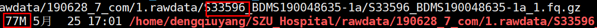

## 文件提取

1. 根据对方提供样本号，从317中软链接309株到SoftLink目录

2. 样本中文名在线翻译 `tanzhanxin与tanzhenxin不匹配`

3. 7株后来测的，用find会有两个结果，使用tail -n 1 选择后来的文件．



```bash
#! /bin/bash
for i in $(cat sample_id.txt)
do
j=$(find /home/dengqiuyang/SZU_Hospital/rawdata -name "*$i*"|grep 1.fq.gz|tail -n 1)
k=$(find /home/dengqiuyang/SZU_Hospital/rawdata -name "*$i*"|grep 2.fq.gz|tail -n 1)
# echo $i
ln -s  $j /home/dengqiuyang/SZU_Hospital/clean_rawdata/SoftLink
ln -s  $k /home/dengqiuyang/SZU_Hospital/clean_rawdata/SoftLink
done
```

## 质控

### 组装质量

#### 过滤低质量碱基

##### 生成执行文件

```bash
#! /bin/bash
n=1
for i in SoftLink/*1.fq.gz
do
path=$(pwd)
j=$(echo $i|awk -F [/_] '{print $2}')
echo trimmomatic PE -phred33 ${path}/$i ${path}/${i/1.fq.gz/2.fq.gz} ${path}/trimmed_data/${j}_forward_paired.fq.gz ${path}/trimmed_data/${j}_forward_unpaired.fq.gz ${path}/trimmed_data/${j}_reverse_paired.fq.gz ${path}/trimmed_data/${j}_reverse_unpaired.fq.gz  LEADING:3 TRAILING:3 SLIDINGWINDOW:4:15 MINLEN:36 >trimmed_data/qsub/${j}.${n}.sh
let n+=1
done
```

##### 批量运行

```python
#! /bin/python
import glob
f_list = glob.glob("../*.sh")
n = 1
for i in range(0,len(f_list),16):
    o = open("command{}.sh".format(n),'w')
    l = f_list[i:i+16]
    l = ["sh "+i for i in l]
    x = " & ".join(l)
    o.write(x+"\necho \"{} running successful\"\n".format(n))
    n += 1
    o.close()
```

#### De novo组装

```bash
#! /bin/bash
n=1
for i in SoftLink/*1.fq.gz
do
path=$(pwd)
j=$(echo $i|awk -F [/_] '{print $2}')
echo spades.py -o ${path}/assembled_data/$j -1 ${path}/trimmed_data/${j}_forward_paired.fq.gz -2 ${path}/trimmed_data/${j}_reverse_paired.fq.gz -k 41,49,57,65,77,85,93 --cov-cutoff auto >assembled_data/qsub/${j}.${n}.sh
let n+=1
done
```

#### 质量评估:

1. fasta文件3-5M;
2. \> 1Kb的contigs < 1000;
3. \>1Kb的contigs数目 > 总contigs数目的90%

### 基因组相似度

#### 数据库比对

> 原理参见[mash Tutorial](../生信软件/mash.md)

```bash
# 下载msh文件
wget https://gembox.cbcb.umd.edu/mash/refseq.genomes.k21s1000.msh
	# 31万个基因组
# 比对分析
for i in *fasta; do mash dist mash_ref/refseq.genomes.k21s1000.msh $i | sort -gk3 | head -n 1 >>re.xx.tab;done
# 寻找物种信息
mash info refseq.genomes.k21s1000.msh >info.txt
cat xx.tab | sort -gk3 | while read line ; do i=$(echo $line|awk '{print $1}');j=$(grep -A1 $i info.txt |tail -n 1); echo "${line}$j" >> xxx.tab;done
```

1. fasta文件top match是不动杆菌;
2. 相似度 > 70%.

### SNP杂合度

#### 比对参考基因组

```bash
# 建立索引
bwa index ref.fa
# 比对参考基因组
bwa mem -t 2  ../ref/ref.fa 1.fq.gz 2.fq.gz |samtools sort -@ 2 -o SRR7696207.bam -
```

#### 质量评估

```bash
# 修改het_snp_calculator.pl内本地模块路径,cpan安装必须模块,方法参见F:\myproject\notebook\perl模块安装.md
# 另外需要修改het_snp_calculator.pl的samtools和bcftools别称,去掉-1.3才能正常引用.
perl het_snp_calculator.pl cojunquan.bam ref.ab.fasta xx
```

1. < 1000个杂合SNP;
2. 平均深度 > 20X.

