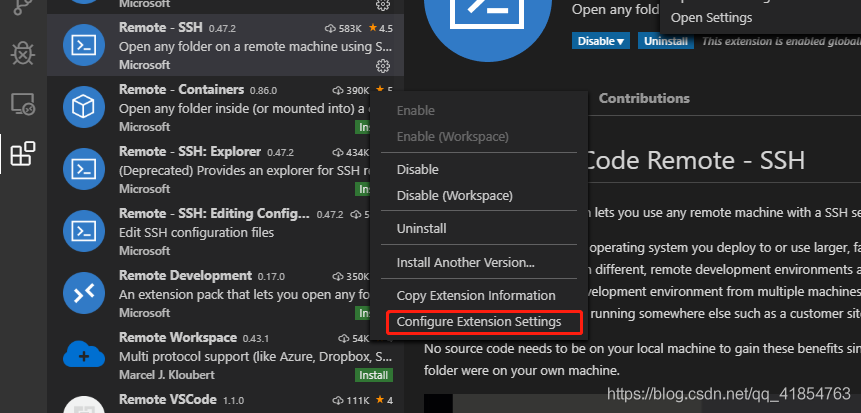
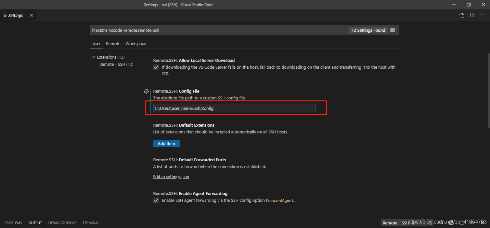

Windows10使用VS Code remote-ssh报错：

**Could not establish connection to “your\_server\_ip\_address”. The process tried to write to a nonexistent pipe.** 

如果发生这个错误，仔细观察vscode的输出，如果能看到如下这句话： 

**Bad owner or permissions on C:\\Users\\user\_name/.ssh/config** 

那就说明是权限问题。只需要一步即可解决这个问题，即打开Remote - SSH的设置：      然后在设置页面的这一栏中将上面那个路径输入即可！   