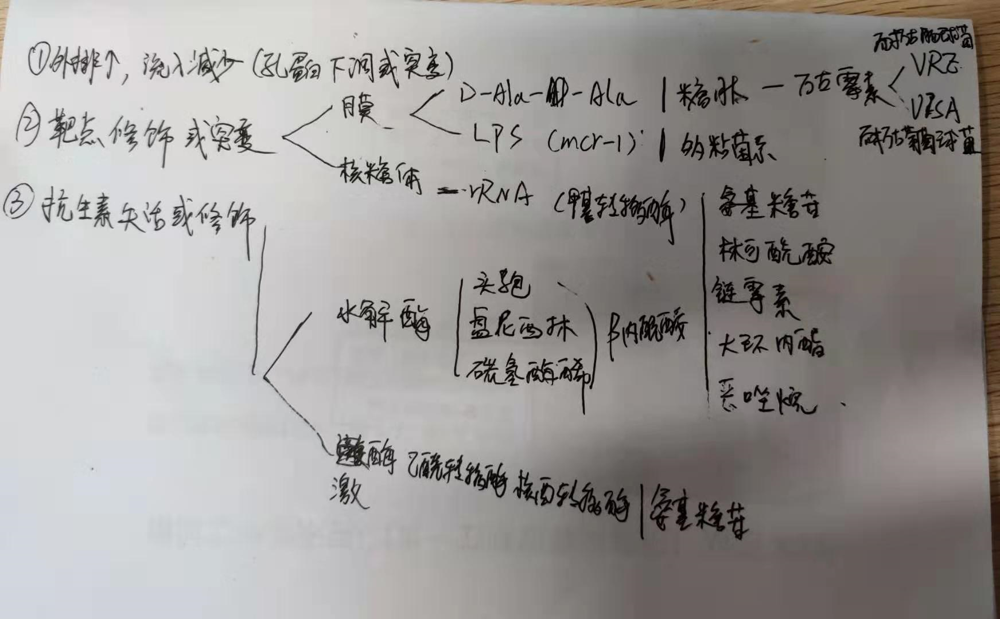
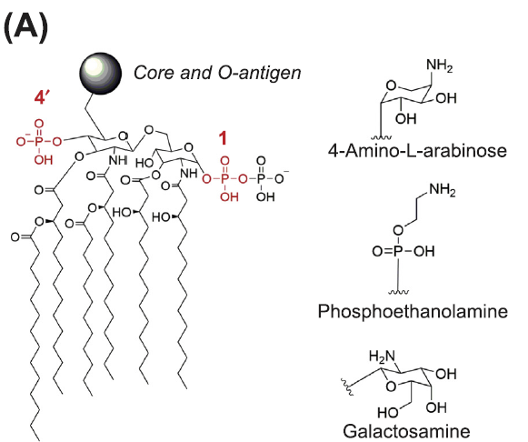

## 主要耐药机制

### 糖肽

> 以万古霉素为例
>
> 糖肽类药物还有一种:替考拉宁

#### VRE(耐万古肠球菌)耐药机制

> 普遍

由‘van’ cassettes介导,可以通过水平基因转移

1. A:D-alanine  替换成D-lactate,亲和力下降
2. B:的D-Ala-D-ala 被替换成D-Ala-D-lac

#### VISA和VRSA(耐金黄色葡萄球菌 中介和耐药)

> 相对少见

由细胞壁调控蛋白（例如VraRS，WalKR和GraRS）中点突变的积累以及PBP2A和PBP4的修饰调控

### 粘菌素

> Polymyxin B 和 colistin (polymyxin E),具有神经毒性和肾毒性

耐药可以通过修饰LPS,外排泵和胶囊多糖过表达

#### 修饰LPS

主要通过在下图左边红色区域添加右边的三种官能团

- 4-amino-L-arabinose(L-Ara4N):4-氨基-L-**阿拉伯糖**
- phosphoethanolamine (PEtn):**磷酸乙醇胺**
- galactosamine:**半乳糖胺**.

**阿拉伯糖**的<u>修饰</u>在肠杆菌和铜绿中，鲍曼不存在.

<u>修饰</u>是由糖基转移酶PmrK / ArnT**催化的.

<u>合成和连接</u>主要PmrAB两种系统直接调控,PhoPQ系统间接调控.

**磷酸乙醇胺**也是PmrAB两种系统直接调控,激活PmrC,连接到1位.

PmrC依赖的修饰在肠炎链球菌，大肠杆菌和鲍曼中,铜绿也可以,但是没有产生耐药

**磷酸乙醇胺**还可以通mcr-1调控,截至2019年，共有八个mcr-1变体，所有这些变体都是质粒携带的。 mcr-1变异体已从大肠，肠链，肺克和志贺中分离，以及最近的铜绿和鲍曼.

**半乳糖胺**的修饰都伴随着**磷酸乙醇胺**,所以不好判断耐药性,仅在鲍曼和Francisella tularensis中.

#### 治疗策略

1. 目前主要开发mcr-1酶的小分子抑制剂,目前有蝶烯和甾醇,1-phenyl-2-(phenylamino)-
   ethanone.
2. 另外一个策略是合成反义肽阻止mcr-1转录.

## rRNA甲基化