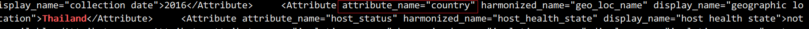

# edirect获取NCBI信息

## 安装

```bash
conda install entrez-direct
```

## 常用方法

### esearch

> 搜索命令，将所要检索的内容提交到 Entrez 中，返回相应的结果记录
>
> -db、-query

搜索并返回xml结果

#### 高级检索

**参数过滤**：

常用的参数为日期参数

*   -days 100：100天内的检索条件命中
*   -maxdate：时间段最大日期，格式可以是 2001，2001/01/01
*   -mindate：时间段最小日期，格式可以是 2001，2001/01/01
*   -datetype: PDAT 发布时间；MDAT 修改时间

**字段定义**：

-query 检索词可以用逻辑关键词构建逻辑关系：

*   AND：和
*   OR：或
*   NOT：非
*   ()：共同定义

-query 检索词还可以使用正则表达式：

*   "*"星号表示任意个匹配的字符

**-query 字符串定义**

建议用 '...' 定义 -query 值，里面的各个关键词用 AND/OR 等建立逻辑关系。关键词组添加 filter 时用 "..." 定义。如：

```bash
esearch -db pubmed -query "listeria monocytogenes AND prfA" -days 300
```

### efetch

> 下载 NCBI 数据库中的记录和报告并以相应格式打印输出

-db、-id、-format、-mode

```bash
# 搜索后下载
esearch -db nuccore -query "salmonella" -days 10| efetch -format fasta >test.fasta

# 直接指定id下载
efetch -db pubmed -id 2137412 -format medline
```

`# 搜索 pubmed 数据库编号 2137412 的文献，以 medline 格式输出
$ efetch -db pubmed -id 2137412 -format medline` 

### xtract

>  edirect 的核心命令,转换xml成纯文本格式的内容

**-outline**  查看xml结构

**-pattern -element**  pattern相当于父节点,element是要找的元素

**-block** 把相同的元素转换成行

**-tab、-sep 参数**: 将多条 element 记录分割。

**/**: 主要用在定义连续多层标签的定义上。比如PMID标签即可以在 MedlineCitation 标签下，有时也会在 RefSource 标签下。所以要明确检索文献的 PMID，就应该用 **MedlineCitation/PMID**

**@**: 指定 XML 元素 element 的 attribute 值

**-if、-if/-equals、-if/-contains 参数**: 条件运算符

**-and、-or、-position、-def 参数**: 关系运算符

```bash
# 查看xml结构
esearch -db assembly -query "GCF_900496465"|efetch -format docsum|xtract -outline
xtract -input XML-file.xml -outline

# 获取元素信息,例子中DocumentSummary是Synonym的父节点
esearch -db assembly -query "GCF_900496465"|efetch -format docsum|xtract -pattern DocumentSummary -element Genbank
esearch -db assembly -query "GCF_900496465"|efetch -format docsum|xtract -pattern Synonym -element Genbank

```

> 进阶
>
> **@**: 指定 XML 元素 element 的 attribute 值
>
> **-if、-if/-equals、-if/-contains 参数**: 条件运算符
>
> **-and、-or、-position、-def 参数**: 关系运算符

### elink

当我们要检索一个数据库数据所关联到其他数据库时，就要用到elink工具了。比如我们先在SRA数据库中搜索到所有鼠伤寒沙门菌的SRA实验数据，然后链接到biosample数据库，获得这些菌株的生物样本信息。

```bash
esearch assembly -query "GCF_900496465"| elink -target biosample | efetch -format docsum > result.xml
```

### einfo

```bash
# 查询所能访问的所有数据库名称
einfo -dbs | sort

# 查询某个数据库字段情况，如 sra 数据库所有对应的字段名称
einfo -db sra -fields

# 查询数据库所有可链接的其他数据库
einfo -db sra -links
```

## 示例

**下载所有甲型副伤寒沙门菌基因组序列**

```bash
$ esearch -db nuccore -query "Salmonella[porgn:__txid54388] complete genome" | \
efetch -db nuccore -format fasta > SPA.fasta
```

**下载assembly数据库的refseq序列**

```
esearch -db assembly -query "Klebsiella pneumoniae [ORGN] AND 2010[GRLS]" |  efetch -format docsum |\
xtract -pattern DocumentSummary  -element FtpPath_RefSeq | \
awk -F"/" '{print $0"/"$NF"_genomic.fna.gz"}' |  xargs wget
```

**查看 taxonomy**

*filter [NXLV]* 可以直接输出species级别

```bash
# 获得 taxonomy 数据库里 lis 或 sal 开头的分类名
esearch -db taxonomy -query "lis* OR sal*" | efetch -db taxonomy -format txt

# 获得 species 级的所有克雷伯菌
esearch -db taxonomy -query "Klebsiella[NXLV]" | efetch -db taxonomy -format txt
```

**获取样本地理/样本名称信息**

查看outline发现Attribute没有子节点,通过if判断才能解析到地理位置.



```bash
# 核心在于 -if Attribute@attribute_name -equals country
esearch -db assembly -query GCF_900496415| elink -target biosample |efetch -format docsum |\
xtract -pattern Attributes -block Attribute -if Attribute@display_name -equals "geographic location" -element Attribute

# 获取sample name
esearch -db assembly -query GCF_900496415| elink -target biosample |efetch -format docsum |\
xtract -pattern Attributes -block Attribute -if Attribute@attribute_name -equals "Sample Name" -element Attribute

# 如果没有sample name,获取Strain信息
esearch -db assembly -query GCF_000786735| elink -target biosample |efetch -format docsum |\
xtract -pattern Attributes -block Attribute -if Attribute@attribute_name -equals "Strain" -element Attribute
```

---

**查看2014~2016年发表的霍乱弧菌CTX相关文献的摘要**

```bash
esearch -db pubmed -mindate 2014 -maxdate 2016 -datetype PDAT -query "vibrio cholerae CTX" | efetch -format abstract > abstract.txt

# 另一种写法
esearch -db pubmed -query "vibrio cholerae CTX AND (2014[pdat]:2016[pdat])" | efetch -format abstract > abstract.txt
```

**查看文章作者**

```bash
# 检索关键词，以最近300天为范围
esearch -db pubmed -query "listeria monocytogenes AND prfA" -days 300 | \
efetch -format xml | xtract -pattern PubmedArticle \
-element MedlineCitation/PMID -block Author -sep " " -element LastName,Initials
```

**查看近300天以来发表的文章中，作者中有叫Jim的所有文章题目**

*filter [FULL]*, 查询所有作者列表里有叫Jim的文章标题，这里采用 medline 格式输出，如果要进一步做格式化可以用xml格式再用xtract重新排版打印。

```bash
esearch -db pubmed -days 300 -query "Jim[FULL]" | efetch -format medline |  grep TI | awk -F'- ' '{print $2}'
```

**对10年内发表的检索文献的作者排序**

```bash
esearch -db pubmed -days 3650 -datetype PDAT -query "hlyA" |  efetch -format xml |  xtract -pattern Author -element LastName | sort-uniq-count-rank
```

